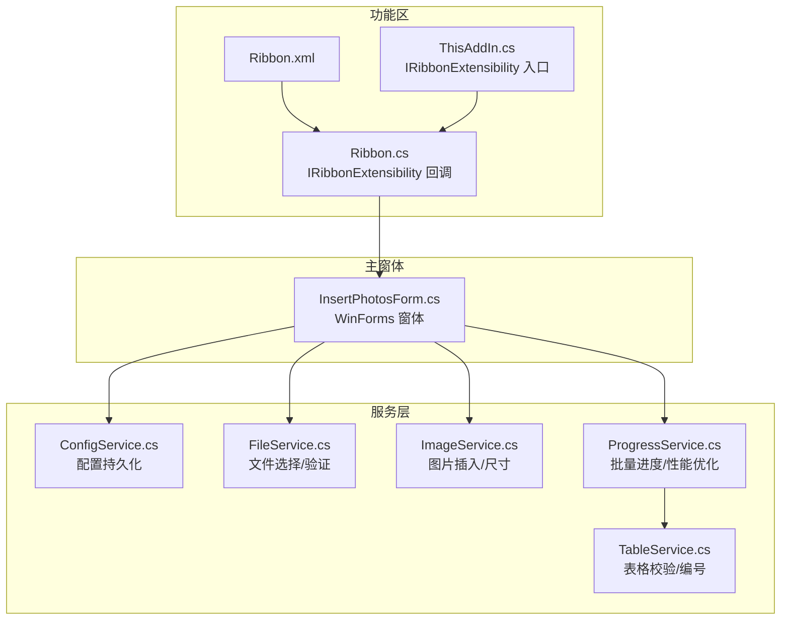
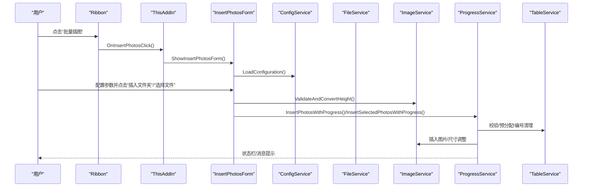
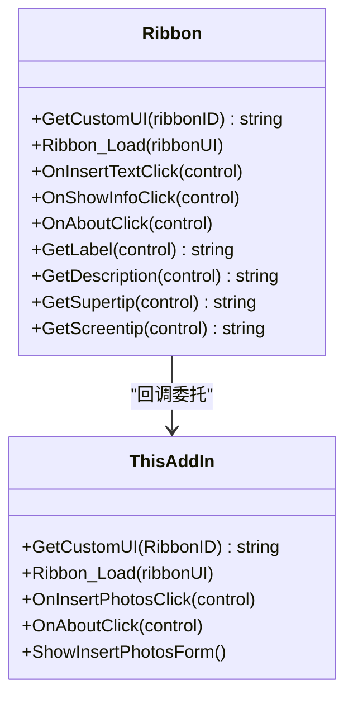
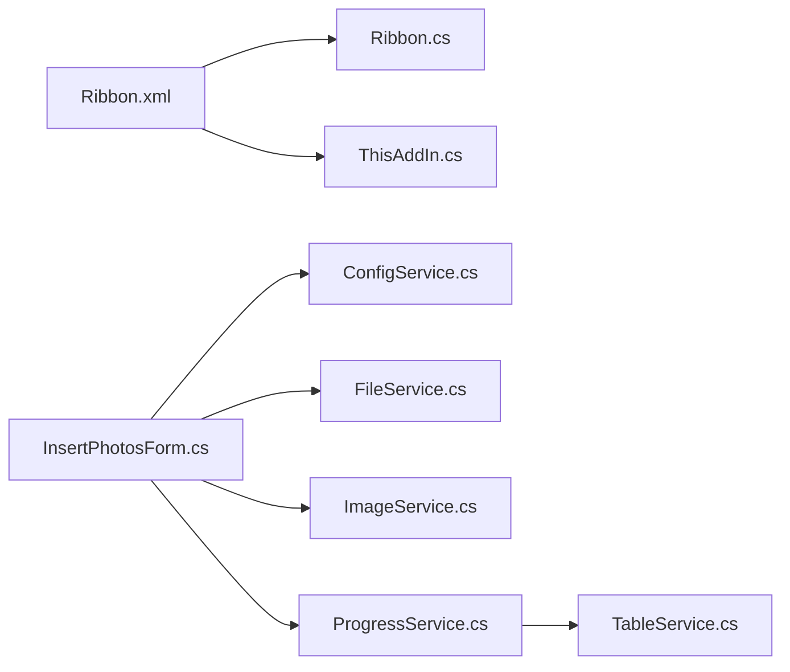

# 用户界面组件

<cite>
**本文引用的文件**
- [InsertPhotosForm.cs](file://WordTools/Forms/InsertPhotosForm.cs)
- [Ribbon.cs](file://WordTools/Ribbon.cs)
- [Ribbon.xml](file://WordTools/Ribbon.xml)
- [Ribbon.Designer.cs](file://WordTools/Ribbon.Designer.cs)
- [Ribbon.resx](file://WordTools/Ribbon.resx)
- [ThisAddIn.cs](file://WordTools/ThisAddIn.cs)
- [ConfigService.cs](file://WordTools/Services/ConfigService.cs)
- [FileService.cs](file://WordTools/Services/FileService.cs)
- [ImageService.cs](file://WordTools/Services/ImageService.cs)
- [ProgressService.cs](file://WordTools/Services/ProgressService.cs)
- [TableService.cs](file://WordTools/Services/TableService.cs)
</cite>

## 目录
1. [简介](#简介)
2. [项目结构](#项目结构)
3. [核心组件](#核心组件)
4. [架构总览](#架构总览)
5. [详细组件分析](#详细组件分析)
6. [依赖关系分析](#依赖关系分析)
7. [性能考量](#性能考量)
8. [故障排查指南](#故障排查指南)
9. [结论](#结论)
10. [附录](#附录)

## 简介
本文件面向 WordTools 的用户界面组件，重点围绕以下目标展开：
- 详细说明主窗体 InsertPhotosForm 的设计与实现，包括控件布局、事件处理与用户交互模式
- 解释功能区组件的设计原则，包括按钮配置、分组与视觉元素
- 深入解析 Ribbon.xml 中的 UI 定义，涵盖控件类型、回调方法与动态更新机制
- 提供界面定制指南，包括图标资源、本地化支持与主题适配
- 覆盖响应式设计与无障碍访问支持的建议
- 总结界面状态管理与用户体验优化策略，并给出扩展与自定义的最佳实践

## 项目结构
WordTools 的界面层由两部分组成：
- 功能区（Ribbon）：通过 Ribbon.xml 定义 UI，Ribbon.cs 实现回调逻辑，ThisAddIn.cs 提供入口与窗体展示
- 主窗体（InsertPhotosForm）：WinForms 窗体，负责批量插图的参数配置与交互流程

图表来源
- [Ribbon.xml:1-39](file://WordTools/Ribbon.xml#L1-L39)
- [Ribbon.cs:1-173](file://WordTools/Ribbon.cs#L1-L173)
- [ThisAddIn.cs:1-157](file://WordTools/ThisAddIn.cs#L1-L157)
- [InsertPhotosForm.cs:1-618](file://WordTools/Forms/InsertPhotosForm.cs#L1-L618)
- [ConfigService.cs:1-362](file://WordTools/Services/ConfigService.cs#L1-L362)
- [FileService.cs:1-310](file://WordTools/Services/FileService.cs#L1-L310)
- [ImageService.cs:1-325](file://WordTools/Services/ImageService.cs#L1-L325)
- [ProgressService.cs:1-571](file://WordTools/Services/ProgressService.cs#L1-L571)
- [TableService.cs:1-756](file://WordTools/Services/TableService.cs#L1-L756)

章节来源
- [Ribbon.xml:1-39](file://WordTools/Ribbon.xml#L1-L39)
- [Ribbon.cs:1-173](file://WordTools/Ribbon.cs#L1-L173)
- [ThisAddIn.cs:1-157](file://WordTools/ThisAddIn.cs#L1-L157)
- [InsertPhotosForm.cs:1-618](file://WordTools/Forms/InsertPhotosForm.cs#L1-L618)

## 核心组件
- InsertPhotosForm：WinForms 窗体，负责批量插图的参数配置与交互流程，包含文件夹选择、图片高度、描述行策略、自动编号与对齐方式等选项
- Ribbon：功能区 UI 定义与回调，承载“批量插图”和“关于”按钮
- 服务层：配置、文件、图片、进度与表格服务协同完成业务逻辑

章节来源
- [InsertPhotosForm.cs:1-618](file://WordTools/Forms/InsertPhotosForm.cs#L1-L618)
- [Ribbon.cs:1-173](file://WordTools/Ribbon.cs#L1-L173)
- [Ribbon.xml:1-39](file://WordTools/Ribbon.xml#L1-L39)

## 架构总览
功能区与主窗体通过回调与窗体展示建立连接，主窗体在用户确认后调用服务层执行批量插入与进度反馈。

图表来源
- [Ribbon.cs:107-110](file://WordTools/Ribbon.cs#L107-L110)
- [ThisAddIn.cs:133-150](file://WordTools/ThisAddIn.cs#L133-L150)
- [InsertPhotosForm.cs:525-613](file://WordTools/Forms/InsertPhotosForm.cs#L525-L613)
- [ProgressService.cs:151-306](file://WordTools/Services/ProgressService.cs#L151-L306)
- [TableService.cs:18-40](file://WordTools/Services/TableService.cs#L18-L40)

## 详细组件分析

### InsertPhotosForm：批量插图主窗体
- 设计目标：以简洁直观的方式让用户配置批量插图参数，并提供一键执行
- 布局与控件
  - 文件夹路径行：标签 + 文本框 + 浏览按钮
  - 图片高度与范围行：高度输入 + 单位标签 + 根目录/子目录复选框
  - 分隔线：用于视觉分区
  - 描述选项行：手动/无/文件名三态单选 + 自动编号复选框（受描述模式影响）
  - 对齐选项行：靠左/居中二态单选
  - 操作按钮行：插入文件夹、选择文件、取消
- 事件处理
  - 浏览按钮：调用文件服务选择文件夹，保存最近路径
  - 描述选项切换：根据“无描述”禁用自动编号
  - 插入文件夹：校验高度、保存配置、隐藏窗体、启动进度服务
  - 选择文件：校验高度、保存配置、隐藏窗体、启动进度服务
- 状态管理
  - 配置加载：从文档自定义属性与注册表读取上次设置
  - 配置保存：将当前设置写回文档与注册表
- 用户体验
  - DPI 缩放启用，字体与颜色方案统一
  - 输入校验与错误提示
  - 进度提示与 ESC 取消

图表来源
- [InsertPhotosForm.cs:509-613](file://WordTools/Forms/InsertPhotosForm.cs#L509-L613)
- [ConfigService.cs:149-178](file://WordTools/Services/ConfigService.cs#L149-L178)

章节来源
- [InsertPhotosForm.cs:1-618](file://WordTools/Forms/InsertPhotosForm.cs#L1-L618)
- [ConfigService.cs:1-362](file://WordTools/Services/ConfigService.cs#L1-L362)
- [FileService.cs:1-310](file://WordTools/Services/FileService.cs#L1-L310)
- [ImageService.cs:1-325](file://WordTools/Services/ImageService.cs#L1-L325)
- [ProgressService.cs:1-571](file://WordTools/Services/ProgressService.cs#L1-L571)

### 功能区组件：设计原则与实现
- 设计原则
  - 紧跟“开始”选项卡之后，便于发现
  - 分组清晰：主功能组“图片工具”，帮助组“帮助”
  - 按钮语义明确，提供屏幕提示与超级提示
  - 使用内置图标（imageMso）提升一致性
- 控件类型与回调
  - 按钮：批量插图（large）、关于（large）
  - 回调：OnInsertPhotosClick、OnAboutClick
  - 文本：标签、描述、超级提示、屏幕提示通过 Ribbon.cs 的 GetLabel/GetDescription/GetScreentip/GetSupertip 返回
- 动态更新机制
  - 通过资源嵌入的 Ribbon.xml 加载 UI
  - 通过 IRibbonExtensibility 接口暴露 UI 与回调

图表来源
- [Ribbon.cs:24-146](file://WordTools/Ribbon.cs#L24-L146)
- [ThisAddIn.cs:65-150](file://WordTools/ThisAddIn.cs#L65-L150)

章节来源
- [Ribbon.cs:1-173](file://WordTools/Ribbon.cs#L1-L173)
- [Ribbon.xml:1-39](file://WordTools/Ribbon.xml#L1-L39)
- [Ribbon.Designer.cs:1-36](file://WordTools/Ribbon.Designer.cs#L1-L36)
- [Ribbon.resx:1-66](file://WordTools/Ribbon.resx#L1-L66)
- [ThisAddIn.cs:1-157](file://WordTools/ThisAddIn.cs#L1-L157)

### Ribbon.xml：UI 定义详解
- 选项卡与分组
  - 选项卡：id 为 tabWordToolbox，label 为“Word工具箱”，插入到“开始”之后
  - 主功能组：grpMainFunctions，“图片工具”
  - 帮助组：grpHelp，“帮助”
- 控件
  - 批量插图按钮：id btnInsertPhotos，label “批量插图”，screentip/supertip 描述功能，large 尺寸，使用内置图标，回调 onAction="OnInsertPhotosClick"
  - 关于按钮：id btnAbout，label “关于”，large 尺寸，回调 onAction="OnAboutClick"
- 资源加载
  - Ribbon.cs 通过资源名加载 Ribbon.xml
  - Ribbon.resx 将 Ribbon.xml 作为资源引用

章节来源
- [Ribbon.xml:1-39](file://WordTools/Ribbon.xml#L1-L39)
- [Ribbon.cs:24-27](file://WordTools/Ribbon.cs#L24-L27)
- [Ribbon.resx:62-64](file://WordTools/Ribbon.resx#L62-L64)

### 界面定制指南
- 图标资源
  - 使用 imageMso 指定 Office 内置图标，确保与系统主题一致
  - 如需自定义图标，可在 Ribbon.xml 中使用 image 或 imageSet 等元素，并在资源中提供多分辨率位图
- 本地化支持
  - 标签、描述、超级提示与屏幕提示通过 Ribbon.cs 的 GetLabel/GetDescription/GetSupertip/GetScreentip 返回，可基于区域文化动态切换
  - InsertPhotosForm 的控件文本与提示也应支持本地化
- 主题适配
  - Office 功能区会随系统主题变化，建议使用 imageMso 并避免硬编码颜色
  - 窗体颜色方案采用常量定义，可按主题调整
- 响应式设计
  - 功能区按钮使用 large 尺寸以提升可点击性
  - 窗体启用 DPI 缩放，保证不同缩放下的可读性
- 无障碍访问
  - 提供 screentip/supertip 与屏幕提示，帮助用户理解控件用途
  - 窗体控件使用统一字体与对比度，确保可读性
  - 为关键按钮提供键盘可达性（例如设置 DialogResult）

章节来源
- [Ribbon.xml:12-31](file://WordTools/Ribbon.xml#L12-L31)
- [Ribbon.cs:113-144](file://WordTools/Ribbon.cs#L113-L144)
- [InsertPhotosForm.cs:63-76](file://WordTools/Forms/InsertPhotosForm.cs#L63-L76)

### 界面状态管理与用户体验优化
- 状态管理
  - 配置持久化：通过 ConfigService 将用户偏好保存至文档自定义属性与注册表
  - 动态禁用：当选择“无描述”时自动禁用“自动编号”
- 用户体验
  - 输入校验：图片高度非空时要求为正数
  - 进度反馈：状态栏实时显示百分比、剩余时间与当前文件名
  - 取消机制：支持按 ESC 键取消
  - 错误提示：异常捕获并以消息框提示

章节来源
- [ConfigService.cs:149-178](file://WordTools/Services/ConfigService.cs#L149-L178)
- [InsertPhotosForm.cs:488-507](file://WordTools/Forms/InsertPhotosForm.cs#L488-L507)
- [ProgressService.cs:51-64](file://WordTools/Services/ProgressService.cs#L51-L64)

### 界面扩展与自定义最佳实践
- 新增功能区按钮
  - 在 Ribbon.xml 中新增按钮，指定 onAction 回调
  - 在 Ribbon.cs 或 ThisAddIn.cs 中实现回调方法
- 新增窗体参数
  - 在 InsertPhotosForm 中新增控件与事件处理
  - 在 ConfigService 中新增配置项并实现读写
- 性能与稳定性
  - 批量操作中启用高性能模式（关闭屏幕更新、警告提示等）
  - 定期清理内存，避免长时间任务导致内存膨胀
  - 对异常进行局部捕获，避免中断整个流程

章节来源
- [Ribbon.xml:12-31](file://WordTools/Ribbon.xml#L12-L31)
- [Ribbon.cs:38-111](file://WordTools/Ribbon.cs#L38-L111)
- [ThisAddIn.cs:107-150](file://WordTools/ThisAddIn.cs#L107-L150)
- [ProgressService.cs:73-142](file://WordTools/Services/ProgressService.cs#L73-L142)

## 依赖关系分析
- 功能区依赖
  - Ribbon.cs 依赖 Ribbon.xml 资源与 IRibbonExtensibility
  - ThisAddIn.cs 同时实现 IRibbonExtensibility 并作为窗体入口
- 窗体依赖
  - InsertPhotosForm 依赖 ConfigService、FileService、ImageService、ProgressService
  - ProgressService 依赖 TableService 完成表格校验与编号
- 资源与本地化
  - Ribbon.resx 将 Ribbon.xml 作为资源引用，便于打包与部署

图表来源
- [Ribbon.xml:1-39](file://WordTools/Ribbon.xml#L1-L39)
- [Ribbon.cs:24-27](file://WordTools/Ribbon.cs#L24-L27)
- [ThisAddIn.cs:65-80](file://WordTools/ThisAddIn.cs#L65-L80)
- [InsertPhotosForm.cs:1-618](file://WordTools/Forms/InsertPhotosForm.cs#L1-L618)
- [ConfigService.cs:1-362](file://WordTools/Services/ConfigService.cs#L1-L362)
- [FileService.cs:1-310](file://WordTools/Services/FileService.cs#L1-L310)
- [ImageService.cs:1-325](file://WordTools/Services/ImageService.cs#L1-L325)
- [ProgressService.cs:1-571](file://WordTools/Services/ProgressService.cs#L1-L571)
- [TableService.cs:1-756](file://WordTools/Services/TableService.cs#L1-L756)

章节来源
- [Ribbon.resx:62-64](file://WordTools/Ribbon.resx#L62-L64)

## 性能考量
- 功能区回调轻量化：仅负责导航与展示，复杂逻辑交由服务层
- 窗体交互：隐藏窗体后再执行耗时操作，避免 UI 卡顿
- 批量处理优化：进入高性能模式、批量添加行、定期清理内存、按文件数量动态调整刷新频率
- 进度反馈：状态栏实时更新，减少用户等待焦虑

章节来源
- [ProgressService.cs:73-142](file://WordTools/Services/ProgressService.cs#L73-L142)
- [InsertPhotosForm.cs:554-561](file://WordTools/Forms/InsertPhotosForm.cs#L554-L561)

## 故障排查指南
- 功能区按钮不可用
  - 检查 Ribbon.xml 是否正确加载（资源名与 resx 引用）
  - 确认回调方法签名与 onAction 名称一致
- 窗体无法打开
  - 检查 ThisAddIn.ShowInsertPhotosForm 的异常捕获与日志
  - 确认 Globals.Application 可用
- 批量插入失败
  - 检查表格选择与第一列定位
  - 确认文件路径与权限
  - 观察状态栏与消息提示，必要时查看异常堆栈
- 配置未生效
  - 检查 ConfigService 的文档属性与注册表写入
  - 确认空值处理（__EMPTY__ 标记）

章节来源
- [Ribbon.resx:62-64](file://WordTools/Ribbon.resx#L62-L64)
- [ThisAddIn.cs:133-150](file://WordTools/ThisAddIn.cs#L133-L150)
- [ProgressService.cs:167-201](file://WordTools/Services/ProgressService.cs#L167-L201)
- [ConfigService.cs:149-178](file://WordTools/Services/ConfigService.cs#L149-L178)

## 结论
本界面组件以功能区与 WinForms 窗体为核心，结合服务层实现参数配置、文件选择、图片插入与进度反馈。通过资源化 UI 定义、统一的颜色与字体方案、以及完善的性能与错误处理机制，提供了稳定、易用且可扩展的用户体验。建议在后续迭代中进一步增强本地化与主题适配能力，并持续优化长任务的进度与取消体验。

## 附录
- 术语
  - IRibbonExtensibility：Office 功能区扩展接口
  - COM：组件对象模型，用于与 Word 交互
  - DPI 缩放：按屏幕分辨率缩放界面元素
- 参考实现路径
  - 功能区 UI 定义：[Ribbon.xml:1-39](file://WordTools/Ribbon.xml#L1-L39)
  - 功能区回调：[Ribbon.cs:24-146](file://WordTools/Ribbon.cs#L24-L146)
  - 窗体入口与展示：[ThisAddIn.cs:107-150](file://WordTools/ThisAddIn.cs#L107-L150)
  - 主窗体实现：[InsertPhotosForm.cs:1-618](file://WordTools/Forms/InsertPhotosForm.cs#L1-L618)
  - 配置持久化：[ConfigService.cs:1-362](file://WordTools/Services/ConfigService.cs#L1-L362)
  - 文件与图片服务：[FileService.cs:1-310](file://WordTools/Services/FileService.cs#L1-L310)、[ImageService.cs:1-325](file://WordTools/Services/ImageService.cs#L1-L325)
  - 进度与表格服务：[ProgressService.cs:1-571](file://WordTools/Services/ProgressService.cs#L1-L571)、[TableService.cs:1-756](file://WordTools/Services/TableService.cs#L1-L756)