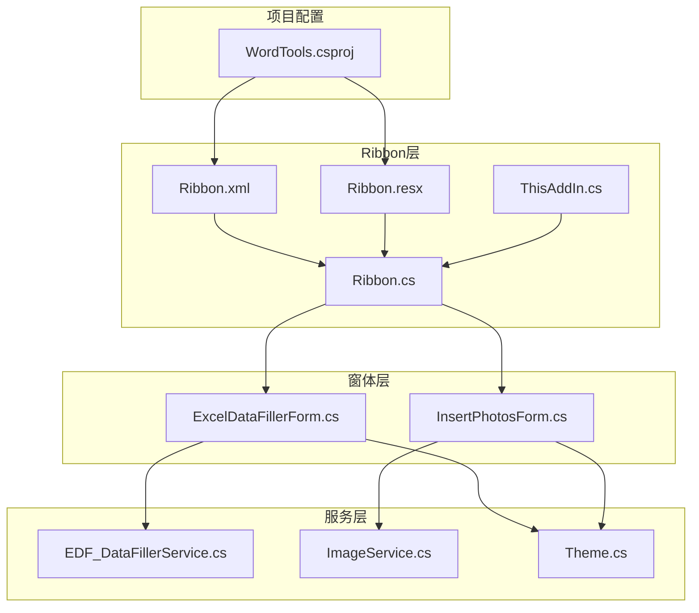
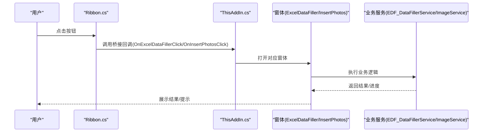
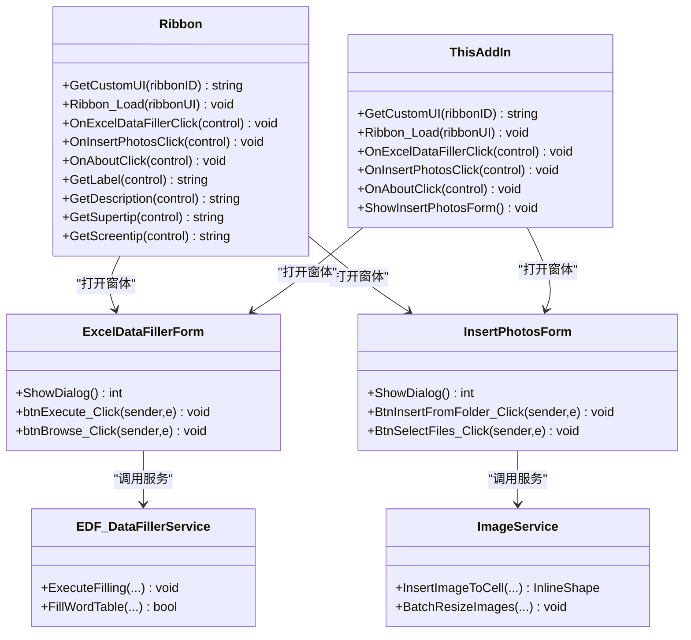

# Ribbon界面设计

<cite>
**本文引用的文件列表**
- [Ribbon.xml](file://WordTools/Ribbon.xml)
- [Ribbon.cs](file://WordTools/Ribbon.cs)
- [Ribbon.Designer.cs](file://WordTools/Ribbon.Designer.cs)
- [Ribbon.resx](file://WordTools/Ribbon.resx)
- [ThisAddIn.cs](file://WordTools/ThisAddIn.cs)
- [ExcelDataFillerForm.cs](file://WordTools/Forms/ExcelDataFillerForm.cs)
- [InsertPhotosForm.cs](file://WordTools/Forms/InsertPhotosForm.cs)
- [EDF_DataFillerService.cs](file://WordTools/Services/EDF_DataFillerService.cs)
- [ImageService.cs](file://WordTools/Services/ImageService.cs)
- [Theme.cs](file://WordTools/Theme.cs)
- [WordTools.csproj](file://WordTools/WordTools.csproj)
</cite>

## 目录
1. [简介](#简介)
2. [项目结构](#项目结构)
3. [核心组件](#核心组件)
4. [架构总览](#架构总览)
5. [详细组件分析](#详细组件分析)
6. [依赖关系分析](#依赖关系分析)
7. [性能考量](#性能考量)
8. [故障排查指南](#故障排查指南)
9. [结论](#结论)
10. [附录](#附录)

## 简介
本文件面向WordTools的Ribbon界面设计，系统性阐述其XML定义结构、回调初始化流程、按钮事件处理机制以及动态文本生成方法。同时提供扩展与自定义指南、最佳实践与性能优化建议，帮助开发者快速理解并维护该VSTO插件的Ribbon界面。

## 项目结构
WordTools采用Office VSTO扩展模式，Ribbon界面通过XML定义与C#回调共同实现。关键文件分布如下：
- Ribbon界面定义：Ribbon.xml
- Ribbon回调与资源嵌入：Ribbon.cs、Ribbon.resx
- 插件入口与Ribbon回调桥接：ThisAddIn.cs
- 界面窗体与业务服务：ExcelDataFillerForm.cs、InsertPhotosForm.cs、EDF_DataFillerService.cs、ImageService.cs、Theme.cs
- 项目工程配置：WordTools.csproj

图表来源
- [Ribbon.xml:1-53](file://WordTools/Ribbon.xml#L1-L53)
- [Ribbon.cs:1-190](file://WordTools/Ribbon.cs#L1-L190)
- [Ribbon.resx:1-66](file://WordTools/Ribbon.resx#L1-L66)
- [ThisAddIn.cs:1-175](file://WordTools/ThisAddIn.cs#L1-L175)
- [ExcelDataFillerForm.cs:1-432](file://WordTools/Forms/ExcelDataFillerForm.cs#L1-L432)
- [InsertPhotosForm.cs:1-574](file://WordTools/Forms/InsertPhotosForm.cs#L1-L574)
- [EDF_DataFillerService.cs:1-564](file://WordTools/Services/EDF_DataFillerService.cs#L1-L564)
- [ImageService.cs:1-325](file://WordTools/Services/ImageService.cs#L1-L325)
- [Theme.cs:1-358](file://WordTools/Theme.cs#L1-L358)
- [WordTools.csproj:1-149](file://WordTools/WordTools.csproj#L1-L149)

章节来源
- [WordTools.csproj:124-131](file://WordTools/WordTools.csproj#L124-L131)

## 核心组件
- Ribbon.xml：定义Ribbon界面的选项卡、组与按钮，绑定回调方法与图标资源。
- Ribbon.cs：实现IRibbonExtensibility接口，负责加载XML、初始化IRibbonUI、提供动态文本回调。
- ThisAddIn.cs：实现IRibbonExtensibility并作为Ribbon回调的桥接层，直接转发按钮点击到对应窗体。
- ExcelDataFillerForm.cs / InsertPhotosForm.cs：对应“Excel数据填充”和“批量插图”的交互窗体。
- EDF_DataFillerService.cs / ImageService.cs：后台业务逻辑与图片处理服务。
- Theme.cs：统一UI主题与控件样式，保障窗体一致性与DPI适配。

章节来源
- [Ribbon.xml:1-53](file://WordTools/Ribbon.xml#L1-L53)
- [Ribbon.cs:1-190](file://WordTools/Ribbon.cs#L1-L190)
- [ThisAddIn.cs:1-175](file://WordTools/ThisAddIn.cs#L1-L175)
- [ExcelDataFillerForm.cs:1-432](file://WordTools/Forms/ExcelDataFillerForm.cs#L1-L432)
- [InsertPhotosForm.cs:1-574](file://WordTools/Forms/InsertPhotosForm.cs#L1-L574)
- [EDF_DataFillerService.cs:1-564](file://WordTools/Services/EDF_DataFillerService.cs#L1-L564)
- [ImageService.cs:1-325](file://WordTools/Services/ImageService.cs#L1-L325)
- [Theme.cs:1-358](file://WordTools/Theme.cs#L1-L358)

## 架构总览
Ribbon界面采用“XML声明 + C#回调”的双层结构：
- XML层：声明UI元素与行为绑定（onAction、label、screentip、supertip、imageMso等）。
- C#层：实现IRibbonExtensibility加载XML，提供Ribbon_Load初始化IRibbonUI，以及各类回调方法（按钮点击、动态文本）。

图表来源
- [Ribbon.cs:113-125](file://WordTools/Ribbon.cs#L113-L125)
- [ThisAddIn.cs:108-142](file://WordTools/ThisAddIn.cs#L108-L142)
- [ExcelDataFillerForm.cs:299-355](file://WordTools/Forms/ExcelDataFillerForm.cs#L299-L355)
- [InsertPhotosForm.cs:513-563](file://WordTools/Forms/InsertPhotosForm.cs#L513-L563)
- [EDF_DataFillerService.cs:30-79](file://WordTools/Services/EDF_DataFillerService.cs#L30-L79)
- [ImageService.cs:142-180](file://WordTools/Services/ImageService.cs#L142-L180)

## 详细组件分析

### Ribbon界面XML结构
- 根节点customUI包含onLoad="Ribbon_Load"，用于初始化IRibbonUI。
- tabs下定义一个选项卡tabWordToolbox，插入到“开始”选项卡之后。
- 三个组：图片工具、工具、帮助，分别包含对应的按钮。
- 按钮通过onAction绑定到具体回调方法，screentip/supertip提供悬停提示，imageMso指定图标。

章节来源
- [Ribbon.xml:1-53](file://WordTools/Ribbon.xml#L1-L53)

### Ribbon_Load初始化与IRibbonUI使用
- Ribbon_Load接收IRibbonUI实例并缓存，供后续动态刷新或状态变更使用。
- 该模式遵循Office VSTO约定，确保Ribbon回调可访问UI实例以进行状态更新。

章节来源
- [Ribbon.cs:33-36](file://WordTools/Ribbon.cs#L33-L36)

### 按钮回调方法实现
- OnExcelDataFillerClick：打开ExcelDataFillerForm窗体。
- OnInsertPhotosClick：打开InsertPhotosForm窗体。
- OnAboutClick：显示关于信息。
- 其他演示回调（如OnHelloButtonClick、OnShowInfoClick）保留用于示例用途。

章节来源
- [Ribbon.cs:113-125](file://WordTools/Ribbon.cs#L113-L125)
- [Ribbon.cs:95-111](file://WordTools/Ribbon.cs#L95-L111)
- [Ribbon.cs:38-48](file://WordTools/Ribbon.cs#L38-L48)
- [Ribbon.cs:70-93](file://WordTools/Ribbon.cs#L70-L93)

### 动态文本生成方法
- GetLabel：根据control.Id返回对应标签文本（选项卡、组、按钮）。
- GetDescription：返回按钮的简要描述文本，用于screentip/supertip。
- GetSupertip：直接复用GetDescription。
- GetScreentip：直接复用GetLabel。

这些方法通过switch控制，确保多语言或本地化需求可通过集中映射扩展。

章节来源
- [Ribbon.cs:127-161](file://WordTools/Ribbon.cs#L127-L161)

### 窗体与业务服务集成
- ExcelDataFillerForm：负责Excel数据读取、锚定字段匹配、表格填充与状态展示。
- InsertPhotosForm：负责图片文件夹/文件选择、高度限制、描述策略、自动编号与对齐方式。
- EDF_DataFillerService：封装Excel读取、Word表格填充、模板检测与状态输出。
- ImageService：封装图片插入、尺寸转换、批量调整与预分配行数等。

章节来源
- [ExcelDataFillerForm.cs:299-355](file://WordTools/Forms/ExcelDataFillerForm.cs#L299-L355)
- [InsertPhotosForm.cs:513-563](file://WordTools/Forms/InsertPhotosForm.cs#L513-L563)
- [EDF_DataFillerService.cs:30-79](file://WordTools/Services/EDF_DataFillerService.cs#L30-L79)
- [ImageService.cs:142-180](file://WordTools/Services/ImageService.cs#L142-L180)

### 资源嵌入与加载机制
- Ribbon.resx将Ribbon.xml作为嵌入资源，Ribbon.cs通过资源名读取XML内容。
- ThisAddIn.cs同样实现IRibbonExtensibility并提供资源读取逻辑，确保Ribbon与插件入口解耦。

章节来源
- [Ribbon.resx:62-64](file://WordTools/Ribbon.resx#L62-L64)
- [Ribbon.cs:24-27](file://WordTools/Ribbon.cs#L24-L27)
- [ThisAddIn.cs:66-81](file://WordTools/ThisAddIn.cs#L66-L81)

## 依赖关系分析

图表来源
- [Ribbon.cs:113-125](file://WordTools/Ribbon.cs#L113-L125)
- [ThisAddIn.cs:108-142](file://WordTools/ThisAddIn.cs#L108-L142)
- [ExcelDataFillerForm.cs:299-355](file://WordTools/Forms/ExcelDataFillerForm.cs#L299-L355)
- [InsertPhotosForm.cs:513-563](file://WordTools/Forms/InsertPhotosForm.cs#L513-L563)
- [EDF_DataFillerService.cs:30-79](file://WordTools/Services/EDF_DataFillerService.cs#L30-L79)
- [ImageService.cs:73-134](file://WordTools/Services/ImageService.cs#L73-L134)

## 性能考量
- 屏幕刷新优化：EDF_DataFillerService在填充Word表格前关闭ScreenUpdating，在完成后恢复，减少UI刷新开销。
- 批量操作：ImageService提供批量添加行与批量调整图片尺寸的批处理方法，降低COM调用频率。
- 状态反馈：通过回调传递状态消息，避免阻塞UI线程，必要时使用Application.DoEvents刷新界面。
- 资源加载：Ribbon.xml作为嵌入资源，避免外部文件依赖，提高加载稳定性。

章节来源
- [EDF_DataFillerService.cs:182-185](file://WordTools/Services/EDF_DataFillerService.cs#L182-L185)
- [EDF_DataFillerService.cs:240-244](file://WordTools/Services/EDF_DataFillerService.cs#L240-L244)
- [ImageService.cs:247-277](file://WordTools/Services/ImageService.cs#L247-L277)
- [ImageService.cs:287-320](file://WordTools/Services/ImageService.cs#L287-L320)

## 故障排查指南
- 无法加载Ribbon：检查Ribbon.resx中的资源项是否正确嵌入，确认资源名与Ribbon.cs/ThisAddIn.cs读取的一致。
- 按钮点击无响应：确认XML中onAction与C#回调方法名一致，且回调可见性为public。
- 动态文本不显示：检查GetLabel/GetDescription等回调是否覆盖对应control.Id分支。
- 窗体异常：查看ExcelDataFillerForm/InsertPhotosForm的输入校验与异常捕获，关注文件路径、高度格式、Excel连接串等。
- COM线程模型：确保涉及Word对象的操作在STA线程上执行，避免跨线程访问导致异常。

章节来源
- [Ribbon.resx:62-64](file://WordTools/Ribbon.resx#L62-L64)
- [Ribbon.cs:127-161](file://WordTools/Ribbon.cs#L127-L161)
- [ExcelDataFillerForm.cs:360-392](file://WordTools/Forms/ExcelDataFillerForm.cs#L360-L392)
- [InsertPhotosForm.cs:481-524](file://WordTools/Forms/InsertPhotosForm.cs#L481-L524)

## 结论
WordTools的Ribbon界面采用清晰的XML+C#回调分离架构，结合统一的主题与服务层，实现了稳定、可扩展的Word插件体验。通过合理的资源嵌入、动态文本回调与性能优化策略，能够在复杂业务场景下保持良好的响应性与可维护性。

## 附录

### 扩展与自定义指南
- 新增按钮
  - 在Ribbon.xml中新增button节点，设置label、screentip、supertip、imageMso与onAction。
  - 在Ribbon.cs或ThisAddIn.cs中实现对应回调方法。
- 图标配置
  - 使用imageMso指定Office内置图标；若需自定义图标，可将图片资源嵌入并使用GetImage回调返回图像。
- 界面布局优化
  - 合理划分组与按钮，保持视觉层级清晰；利用screentip/supertip提供上下文帮助。
  - 使用Theme统一控件样式，确保不同DPI下的显示一致性。

章节来源
- [Ribbon.xml:12-18](file://WordTools/Ribbon.xml#L12-L18)
- [Ribbon.xml:26-32](file://WordTools/Ribbon.xml#L26-L32)
- [Ribbon.xml:39-45](file://WordTools/Ribbon.xml#L39-L45)
- [Theme.cs:159-171](file://WordTools/Theme.cs#L159-L171)

### Office VSTO Ribbon扩展最佳实践
- 使用IRibbonExtensibility实现UI与逻辑分离，便于测试与维护。
- 将XML作为嵌入资源，避免部署时的文件丢失问题。
- 回调方法尽量轻量，耗时任务交由后台服务或异步执行。
- 动态文本与状态通过回调集中管理，避免硬编码。
- 注意COM线程模型与资源释放，避免内存泄漏与死锁。

章节来源
- [Ribbon.cs:24-27](file://WordTools/Ribbon.cs#L24-L27)
- [ThisAddIn.cs:66-81](file://WordTools/ThisAddIn.cs#L66-L81)
- [ExcelDataFillerForm.cs:330-355](file://WordTools/Forms/ExcelDataFillerForm.cs#L330-L355)
- [InsertPhotosForm.cs:513-563](file://WordTools/Forms/InsertPhotosForm.cs#L513-L563)