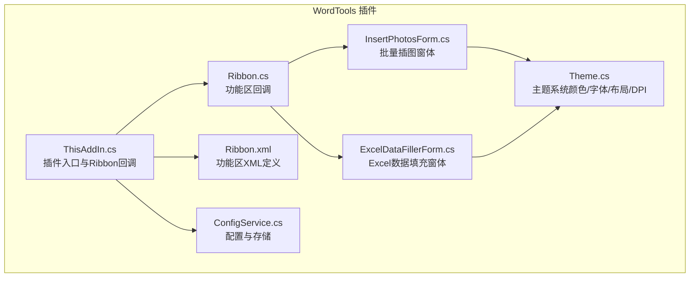
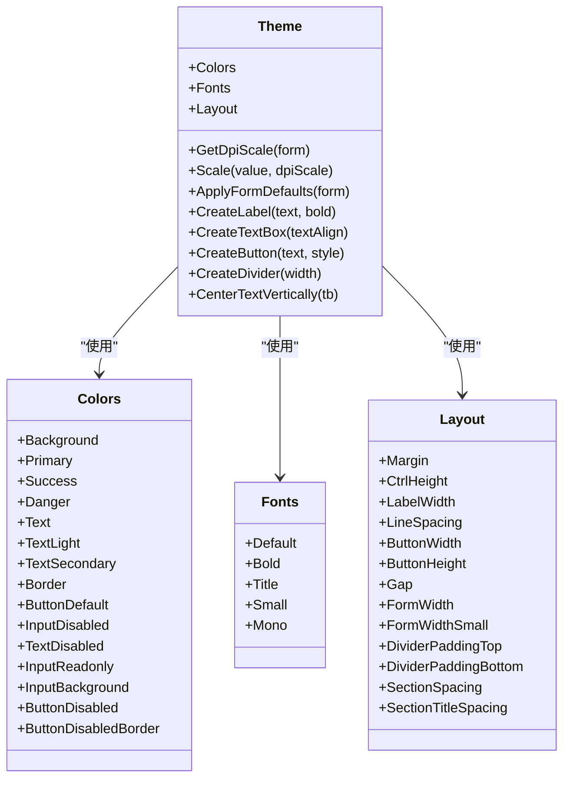
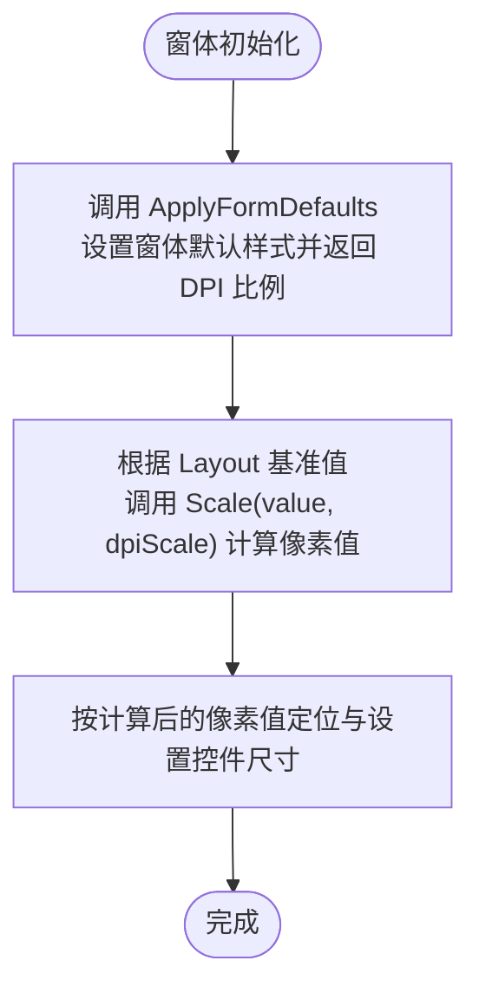
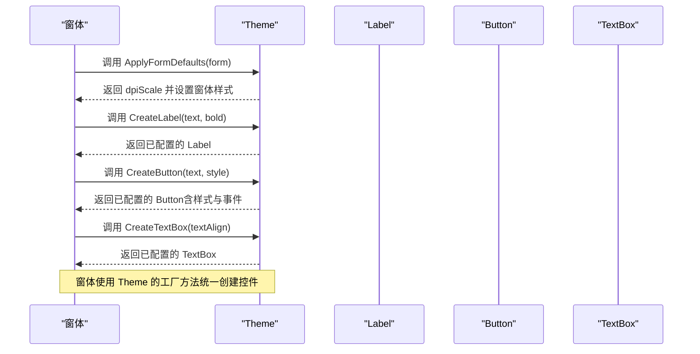
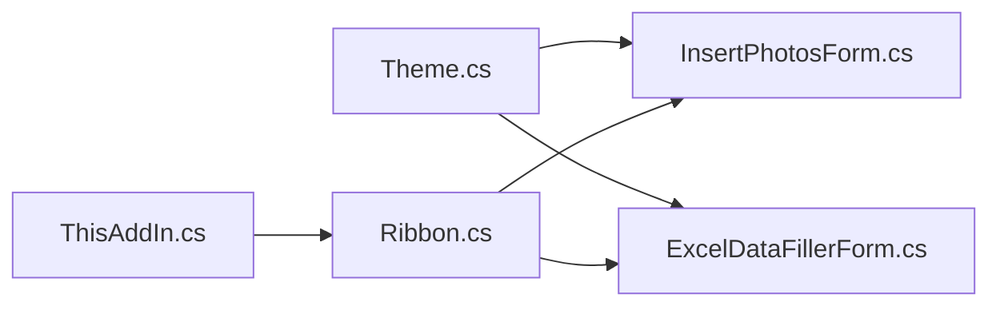

# 主题系统

<cite>
**本文引用的文件**
- [Theme.cs](file://WordTools/Theme.cs)
- [Ribbon.cs](file://WordTools/Ribbon.cs)
- [ThisAddIn.cs](file://WordTools/ThisAddIn.cs)
- [Ribbon.xml](file://WordTools/Ribbon.xml)
- [InsertPhotosForm.cs](file://WordTools/Forms/InsertPhotosForm.cs)
- [ExcelDataFillerForm.cs](file://WordTools/Forms/ExcelDataFillerForm.cs)
- [ConfigService.cs](file://WordTools/Services/ConfigService.cs)
- [README.md](file://README.md)
</cite>

## 目录
1. [简介](#简介)
2. [项目结构](#项目结构)
3. [核心组件](#核心组件)
4. [架构总览](#架构总览)
5. [详细组件分析](#详细组件分析)
6. [依赖关系分析](#依赖关系分析)
7. [性能考量](#性能考量)
8. [故障排查指南](#故障排查指南)
9. [结论](#结论)
10. [附录](#附录)

## 简介
本文件面向WordTools的“主题系统”，系统性阐述界面主题的设计理念、实现机制与最佳实践。主题系统通过统一的颜色方案、字体样式与布局常量，集中管理所有WinForms窗体的视觉风格；同时提供DPI缩放能力，确保在不同DPI与多显示器环境下的一致体验。此外，文档还覆盖与Office主题的兼容性策略、自定义主题的创建指南、扩展点与第三方主题集成方法，以及高DPI与多显示器适配建议，帮助UI设计师与开发者高效落地一致、美观且易维护的界面风格。

## 项目结构
WordTools采用COM加载项架构，在Word功能区添加自定义选项卡。主题系统的核心位于Theme类，统一管理颜色、字体与布局，并在各窗体中被广泛使用。Ribbon与ThisAddIn负责功能区UI与插件生命周期，窗体层通过Theme提供的工厂方法快速构建一致的控件与布局。

图表来源
- [ThisAddIn.cs:17-174](file://WordTools/ThisAddIn.cs#L17-L174)
- [Ribbon.cs:14-189](file://WordTools/Ribbon.cs#L14-L189)
- [Ribbon.xml:1-53](file://WordTools/Ribbon.xml#L1-L53)
- [Theme.cs:11-358](file://WordTools/Theme.cs#L11-L358)
- [InsertPhotosForm.cs:19-200](file://WordTools/Forms/InsertPhotosForm.cs#L19-L200)
- [ExcelDataFillerForm.cs:12-200](file://WordTools/Forms/ExcelDataFillerForm.cs#L12-L200)
- [ConfigService.cs:11-463](file://WordTools/Services/ConfigService.cs#L11-L463)

章节来源
- [README.md:1-85](file://README.md#L1-L85)
- [Theme.cs:11-358](file://WordTools/Theme.cs#L11-L358)

## 核心组件
- 主题颜色（Colors）：定义背景、主色调、成功/危险、文本、边框、按钮与输入框等状态色，形成统一的色彩语义。
- 字体方案（Fonts）：提供默认、加粗、标题、小号与等宽字体，确保文本层级与代码展示一致性。
- 布局常量（Layout）：以96 DPI为基准的像素值，涵盖窗体边距、控件高度、标签宽度、行间距、按钮尺寸与窗体宽度等，便于跨DPI缩放。
- DPI缩放（GetDpiScale、Scale）：动态获取当前窗体DPI并按比例缩放布局与控件尺寸。
- 控件工厂（CreateLabel、CreateTextBox、CreateButton、CreateDivider）：封装控件初始化与样式应用，保证全局一致性。
- 按钮样式（ButtonStyle）：提供主色调、成功与默认三种样式，自动处理启用/禁用状态下的外观变化。
- 文本垂直居中（CenterTextVertically）：通过Win32消息调整TextBox内容矩形，实现视觉上的垂直居中。

章节来源
- [Theme.cs:16-128](file://WordTools/Theme.cs#L16-L128)
- [Theme.cs:135-171](file://WordTools/Theme.cs#L135-L171)
- [Theme.cs:179-355](file://WordTools/Theme.cs#L179-L355)

## 架构总览
主题系统以静态类Theme为核心，向窗体与控件提供统一的视觉规范。窗体在初始化阶段调用ApplyFormDefaults应用默认样式与DPI缩放，随后使用Create系列工厂方法创建控件，确保颜色、字体与布局一致。功能区通过ThisAddIn与Ribbon类加载XML定义并响应用户交互，间接驱动窗体展示。

图表来源
- [Theme.cs:11-358](file://WordTools/Theme.cs#L11-L358)

## 详细组件分析

### 主题颜色与字体体系
- 颜色体系：以业务语义划分主色、成功/危险、文本与边框等类别，避免直接硬编码颜色，提升可维护性与一致性。
- 字体体系：区分正文、标题、强调与等宽场景，确保信息层级清晰，代码片段可读性强。
- 设计原则：颜色与字体均以常量形式集中管理，窗体与控件仅通过Theme访问，避免分散修改导致的视觉不一致。

章节来源
- [Theme.cs:16-83](file://WordTools/Theme.cs#L16-L83)

### 布局常量与DPI缩放
- 基准值：Layout中的常量以96 DPI为基准，确保在不同DPI下通过Scale进行线性缩放。
- 缩放流程：窗体初始化时调用ApplyFormDefaults获取DPI比例，随后将Theme中的基准值乘以dpiScale得到实际像素值，用于控件定位与尺寸。
- 行为特征：Scale为整型缩放，避免浮点误差累积；GetDpiScale基于Graphics.DpiX计算，能准确反映当前显示设备DPI。

图表来源
- [Theme.cs:159-171](file://WordTools/Theme.cs#L159-L171)
- [Theme.cs:149-152](file://WordTools/Theme.cs#L149-L152)

章节来源
- [Theme.cs:88-128](file://WordTools/Theme.cs#L88-L128)
- [Theme.cs:135-152](file://WordTools/Theme.cs#L135-L152)

### 控件工厂与样式应用
- 标签（CreateLabel）：自动设置字体与前景色，支持加粗。
- 文本框（CreateTextBox）：统一默认字体、多行与禁止换行，提供垂直居中辅助方法。
- 按钮（CreateButton）：统一Flat样式与手型光标；根据样式类型设置背景、前景与边框；监听Enabled变化自动切换禁用态外观。
- 分隔线（CreateDivider）：使用边框色绘制细线，便于逻辑分区。

图表来源
- [Theme.cs:179-355](file://WordTools/Theme.cs#L179-L355)
- [InsertPhotosForm.cs:104-133](file://WordTools/Forms/InsertPhotosForm.cs#L104-L133)
- [ExcelDataFillerForm.cs:68-88](file://WordTools/Forms/ExcelDataFillerForm.cs#L68-L88)

章节来源
- [Theme.cs:179-355](file://WordTools/Theme.cs#L179-L355)
- [InsertPhotosForm.cs:104-200](file://WordTools/Forms/InsertPhotosForm.cs#L104-L200)
- [ExcelDataFillerForm.cs:68-200](file://WordTools/Forms/ExcelDataFillerForm.cs#L68-L200)

### 窗体中的主题应用示例
- 批量插图窗体：在InitializeComponent中应用默认样式与DPI缩放，预计算布局常量，逐行创建控件并使用Theme工厂方法，确保整体风格一致。
- Excel数据填充窗体：同样在初始化阶段应用默认样式与DPI缩放，使用Theme的字体与颜色常量设置标签与输入框的外观，分隔线与状态区域也遵循统一规范。

章节来源
- [InsertPhotosForm.cs:49-100](file://WordTools/Forms/InsertPhotosForm.cs#L49-L100)
- [ExcelDataFillerForm.cs:44-62](file://WordTools/Forms/ExcelDataFillerForm.cs#L44-L62)

### 功能区与主题的关系
- 功能区UI由Ribbon与Ribbon.xml定义，主题系统不直接参与功能区渲染；但功能区回调会打开使用Theme统一样式的窗体，从而间接体现主题效果。
- ThisAddIn负责加载Ribbon.xml并提供回调方法，维持插件生命周期与状态刷新。

章节来源
- [Ribbon.cs:24-161](file://WordTools/Ribbon.cs#L24-L161)
- [Ribbon.xml:1-53](file://WordTools/Ribbon.xml#L1-L53)
- [ThisAddIn.cs:66-101](file://WordTools/ThisAddIn.cs#L66-L101)

## 依赖关系分析
- Theme是窗体与控件的唯一视觉来源，耦合度低、内聚度高。
- 窗体通过Theme的工厂方法创建控件，避免在窗体层重复设置样式，降低维护成本。
- DPI缩放依赖Graphics对象，需在窗体已创建句柄后进行，Theme在必要时强制创建句柄以确保正确性。

图表来源
- [Theme.cs:11-358](file://WordTools/Theme.cs#L11-L358)
- [InsertPhotosForm.cs:19-200](file://WordTools/Forms/InsertPhotosForm.cs#L19-L200)
- [ExcelDataFillerForm.cs:12-200](file://WordTools/Forms/ExcelDataFillerForm.cs#L12-L200)
- [ThisAddIn.cs:17-174](file://WordTools/ThisAddIn.cs#L17-L174)
- [Ribbon.cs:14-189](file://WordTools/Ribbon.cs#L14-L189)

## 性能考量
- DPI缩放：在窗体初始化阶段一次性计算dpiScale并缓存，后续所有布局计算复用该比例，避免重复测量带来的性能损耗。
- 控件创建：通过工厂方法集中设置控件属性，减少重复代码与分支判断，提高可读性与维护效率。
- 文本垂直居中：CenterTextVertically在控件尺寸确定后调用，避免频繁重绘；仅在需要时执行，减少不必要的Win32消息调用。

章节来源
- [Theme.cs:159-171](file://WordTools/Theme.cs#L159-L171)
- [Theme.cs:239-255](file://WordTools/Theme.cs#L239-L255)

## 故障排查指南
- 按钮禁用态颜色异常：检查EnabledChanged事件是否被覆盖或未触发；确认ApplyButtonStyle在启用/禁用状态下分别设置对应颜色。
- 文本框垂直居中无效：确保在设置Size后再调用CenterTextVertically，并确认控件句柄已创建（Theme内部会强制创建）。
- DPI缩放不生效：确认在InitializeComponent中先调用ApplyFormDefaults获取dpiScale，再使用S()或Theme.Scale()进行缩放；避免在控件创建前使用未缩放的基准值。
- 多显示器DPI不一致：Theme.GetDpiScale基于当前窗体的Graphics.DpiX，确保在不同DPI显示器上分别计算缩放比例；如出现跳变，检查窗体是否在启动时位于正确显示器。

章节来源
- [Theme.cs:290-310](file://WordTools/Theme.cs#L290-L310)
- [Theme.cs:239-255](file://WordTools/Theme.cs#L239-L255)
- [Theme.cs:135-152](file://WordTools/Theme.cs#L135-L152)

## 结论
WordTools的主题系统通过集中化的颜色、字体与布局管理，结合DPI缩放与控件工厂，实现了跨窗体、跨DPI的一致视觉体验。其设计理念强调“单一真实来源”与“最小化重复”，既满足UI设计师的规范需求，也为开发者提供了清晰的扩展点。在Office环境中，主题系统通过窗体间接影响功能区的用户体验，确保插件界面与Office主题风格协调统一。

## 附录

### 主题切换与应用流程（概念说明）
- 触发条件：当前实现未提供显式“主题切换”接口。若需支持动态主题，可在Theme外层增加主题枚举与切换方法，并在ApplyFormDefaults与控件工厂中注入切换逻辑。
- 应用过程：切换后重新调用ApplyFormDefaults与控件工厂，使新主题立即生效；对于已显示的窗体，建议在切换后重建或刷新控件集合。

[本节为概念性说明，不直接分析具体文件，故不附“章节来源”]

### 与Office主题的兼容性与适配策略
- Office主题主要影响功能区外观（如深浅主题），而窗体主题由Theme统一管理。建议：
  - 在深色主题下，适当调整按钮与输入框的边框与禁用态颜色，确保对比度与可读性。
  - 对于高对比度场景，优先使用Theme中的TextLight与TextDisabled等弱化文本色，避免视觉疲劳。
  - 通过测试不同DPI与主题组合，验证控件布局与文字可读性。

[本节为通用建议，不直接分析具体文件，故不附“章节来源”]

### 自定义主题创建指南
- 颜色定义：在Theme.Colors中新增语义化颜色常量，如Warning、Info等，避免直接使用RGB值。
- 样式规则：通过Theme.Fonts与Layout扩展字体族与布局基准，确保新控件遵循统一规范。
- 资源管理：将主题相关的资源（图标、图片）集中管理，避免散落于窗体层。
- 渐进式迁移：优先在新窗体中应用新主题，逐步替换旧窗体，保持过渡期的视觉一致性。

[本节为通用指南，不直接分析具体文件，故不附“章节来源”]

### 扩展点与第三方主题集成
- 扩展点：在Theme外部增加IAppTheme接口与默认实现，允许注入第三方主题；在窗体初始化时注入并应用。
- 集成方法：提供主题包（包含颜色、字体与布局配置），在插件启动时加载并替换Theme中的默认配置；注意保持与现有控件工厂的兼容性。

[本节为通用建议，不直接分析具体文件，故不附“章节来源”]

### 高DPI与多显示器适配
- 高DPI支持：使用Theme.GetDpiScale与Scale进行线性缩放；在控件尺寸与位置计算中统一使用缩放后的像素值。
- 多显示器：确保窗体在启动时位于正确的显示器；如需跨屏移动，重新计算dpiScale并刷新布局。
- 文本渲染：在高DPI下关注字体渲染质量，必要时调整字体大小或使用ClearType优化。

章节来源
- [Theme.cs:135-152](file://WordTools/Theme.cs#L135-L152)
- [Theme.cs:159-171](file://WordTools/Theme.cs#L159-L171)