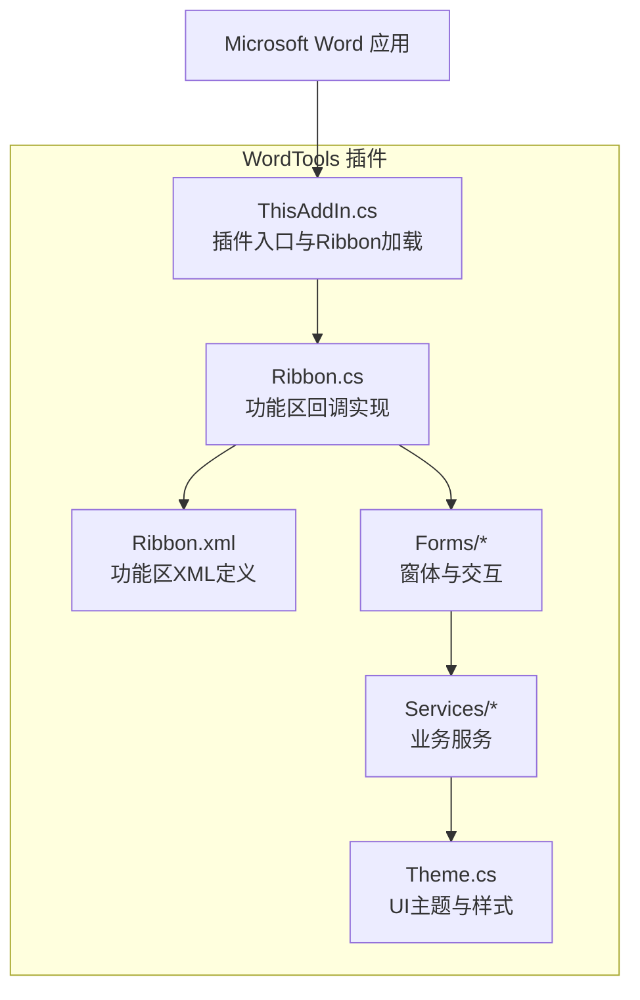
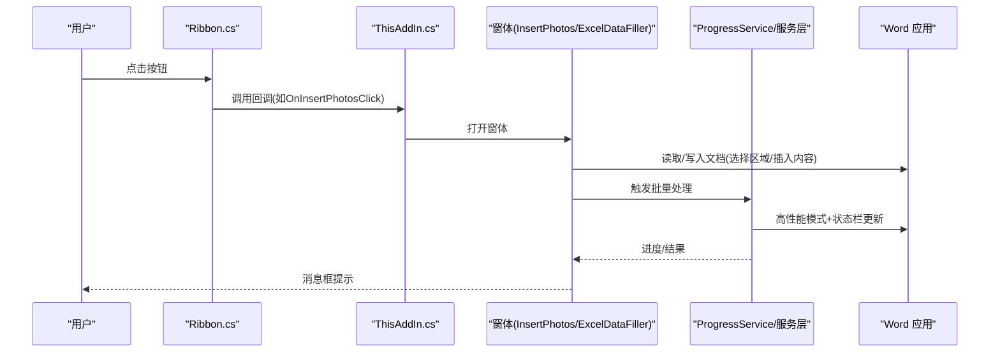
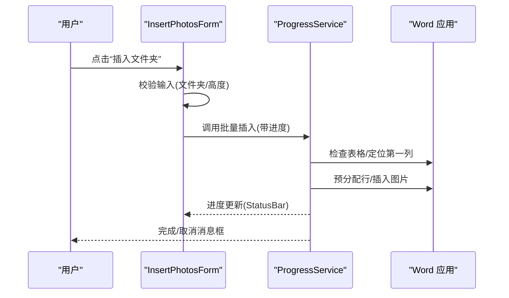
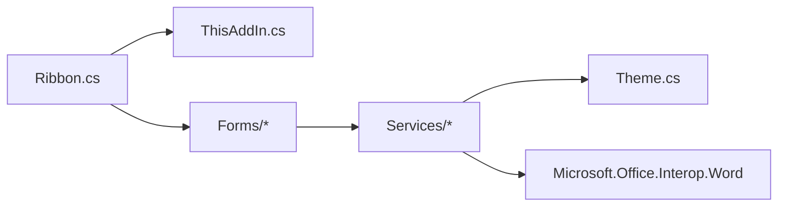
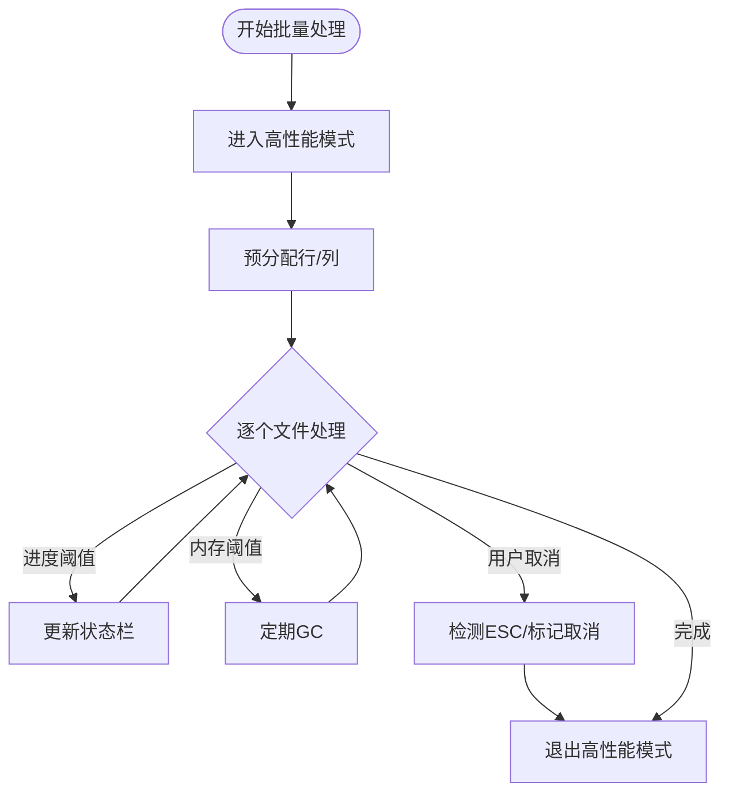

# 界面交互模式

<cite>
**本文引用的文件**   
- [Ribbon.cs](file://WordTools/Ribbon.cs)
- [Ribbon.Designer.cs](file://WordTools/Ribbon.Designer.cs)
- [ThisAddIn.cs](file://WordTools/ThisAddIn.cs)
- [Ribbon.xml](file://WordTools/Ribbon.xml)
- [ExcelDataFillerForm.cs](file://WordTools/Forms/ExcelDataFillerForm.cs)
- [InsertPhotosForm.cs](file://WordTools/Forms/InsertPhotosForm.cs)
- [ProgressService.cs](file://WordTools/Services/ProgressService.cs)
- [Theme.cs](file://WordTools/Theme.cs)
- [WordTools.csproj](file://WordTools/WordTools.csproj)
- [README.md](file://README.md)
</cite>

## 目录
1. [简介](#简介)
2. [项目结构](#项目结构)
3. [核心组件](#核心组件)
4. [架构总览](#架构总览)
5. [详细组件分析](#详细组件分析)
6. [依赖关系分析](#依赖关系分析)
7. [性能与响应性](#性能与响应性)
8. [无障碍与国际化](#无障碍与国际化)
9. [调试与测试指南](#调试与测试指南)
10. [结论](#结论)

## 简介
本文件面向WordTools的界面交互模式，系统化梳理Ribbon界面与用户交互流程、按钮状态管理与动态启用机制、消息框使用模式（信息提示、警告与错误）、与Word文档的交互（文档检查、选择区域操作、内容插入）、界面响应性优化（异步与进度指示）、无障碍支持（键盘导航与屏幕阅读器兼容）、国际化与本地化策略，以及开发者调试与测试方法。文档基于仓库源码进行分析，避免臆测，确保可追溯性。

## 项目结构
WordTools采用COM加载项（IDTExtensibility2）实现，不依赖VSTO，通过Ribbon XML定义功能区，C#代码实现回调与窗体逻辑。关键文件与职责如下：
- Ribbon.cs：功能区回调实现，负责按钮点击、标签与提示文案、资源加载。
- Ribbon.xml：功能区XML定义，声明选项卡、组、按钮及其行为。
- ThisAddIn.cs：插件入口，负责连接Word应用、暴露Ribbon UI、刷新状态。
- Forms：窗体层，包含批量插图与Excel数据填充工具窗体。
- Services：服务层，封装文件、图像、表格、进度等业务能力。
- Theme.cs：统一UI主题与样式，保证跨DPI与一致性。
- WordTools.csproj：项目配置，声明引用与嵌入资源。

图表来源
- [ThisAddIn.cs:37-81](file://WordTools/ThisAddIn.cs#L37-L81)
- [Ribbon.cs:24-27](file://WordTools/Ribbon.cs#L24-L27)
- [Ribbon.xml:1-53](file://WordTools/Ribbon.xml#L1-L53)

章节来源
- [README.md:1-85](file://README.md#L1-L85)
- [WordTools.csproj:99-123](file://WordTools/WordTools.csproj#L99-L123)

## 核心组件
- 功能区（Ribbon）
  - 通过IRibbonExtensibility加载自定义UI，提供“Word工具箱”选项卡，包含“图片工具”“工具”“帮助”三组按钮。
  - 提供标签与提示文案（GetLabel、GetDescription、GetSupertip、GetScreentip）。
- 插件入口（ThisAddIn）
  - 实现IDTExtensibility2与IRibbonExtensibility，负责连接Word、暴露Ribbon UI、提供刷新机制。
- 窗体交互
  - 批量插图窗体：文件夹/文件选择、高度、范围、描述与编号、对齐等配置，执行批量插入。
  - Excel数据填充窗体：Excel路径、锚定字段、目标列、Sample Size替换等配置，执行填充。
- 服务层
  - ProgressService：高性能模式、状态栏进度、取消控制、内存清理与批量处理。
  - 其他服务：文件、图像、表格、配置等。

章节来源
- [Ribbon.cs:127-161](file://WordTools/Ribbon.cs#L127-L161)
- [ThisAddIn.cs:64-83](file://WordTools/ThisAddIn.cs#L64-L83)
- [ExcelDataFillerForm.cs:38-227](file://WordTools/Forms/ExcelDataFillerForm.cs#L38-L227)
- [InsertPhotosForm.cs:49-100](file://WordTools/Forms/InsertPhotosForm.cs#L49-L100)
- [ProgressService.cs:14-36](file://WordTools/Services/ProgressService.cs#L14-L36)

## 架构总览
Ribbon回调与窗体交互通过ThisAddIn协调，服务层封装Word对象操作与性能优化。消息框贯穿各交互环节，提供信息提示、警告与错误反馈。

图表来源
- [Ribbon.cs:108-111](file://WordTools/Ribbon.cs#L108-L111)
- [ThisAddIn.cs:151-168](file://WordTools/ThisAddIn.cs#L151-L168)
- [InsertPhotosForm.cs:510-518](file://WordTools/Forms/InsertPhotosForm.cs#L510-L518)
- [ProgressService.cs:151-306](file://WordTools/Services/ProgressService.cs#L151-L306)

## 详细组件分析

### 功能区与按钮状态管理
- 标签与提示
  - 通过GetLabel、GetDescription、GetSupertip、GetScreentip返回本地化标签与提示，便于用户理解按钮用途与快捷提示。
- 动态启用机制
  - 当前代码未实现显式的动态启用/禁用逻辑（例如根据文档状态或选择区域）。按钮在Ribbon XML中直接绑定onAction，未见显式的getEnabled回调。
  - 若需动态启用，可在Ribbon.cs中增加对应回调（如GetEnabledXXX），并在回调中检查文档与选择区域状态，返回布尔值。
- 刷新机制
  - ThisAddIn提供InvalidateRibbon方法，可通过外部触发Ribbon重绘，适用于需要根据文档状态改变按钮外观或可用性的场景。

图表来源
- [Ribbon.cs:54-58](file://WordTools/Ribbon.cs#L54-L58)
- [ThisAddIn.cs:151-168](file://WordTools/ThisAddIn.cs#L151-L168)

章节来源
- [Ribbon.cs:127-161](file://WordTools/Ribbon.cs#L127-L161)
- [ThisAddIn.cs:95-101](file://WordTools/ThisAddIn.cs#L95-L101)

### 消息框使用模式
- 信息提示：用于展示文档信息、完成状态、操作说明等。
- 警告显示：用于输入校验失败、缺少必要条件（如未打开文档、未选中表格、未选择文件夹）。
- 错误处理：捕获异常并弹出错误消息框，确保用户感知问题。
- 典型场景
  - 插入文本：检查文档存在性，不存在则提示。
  - 获取文档信息：检查文档存在性，不存在则提示。
  - Excel数据填充：输入校验失败时提示并聚焦到问题控件。
  - 批量插图：未选中表格、未选中文件夹、高度无效、未找到图片等均弹出相应消息框。

章节来源
- [Ribbon.cs:40-48](file://WordTools/Ribbon.cs#L40-L48)
- [Ribbon.cs:54-68](file://WordTools/Ribbon.cs#L54-L68)
- [Ribbon.cs:74-93](file://WordTools/Ribbon.cs#L74-L93)
- [ExcelDataFillerForm.cs:317-355](file://WordTools/Forms/ExcelDataFillerForm.cs#L317-L355)
- [InsertPhotosForm.cs:489-524](file://WordTools/Forms/InsertPhotosForm.cs#L489-L524)

### 与Word文档的交互
- 文档检查
  - 在执行任何文档操作前，先检查活动文档是否存在，避免空引用。
- 选择区域操作
  - 批量插图要求选中表格且位于第一列，否则提示用户调整选择。
- 内容插入
  - 插入文本：在当前选择处插入指定文本。
  - 批量插图：预分配表格行、插入图片、按配置插入描述行或自动编号。
- 表格结构管理
  - 调整列宽、固定列宽、清空编号、添加编号等均由服务层封装。

图表来源
- [InsertPhotosForm.cs:510-518](file://WordTools/Forms/InsertPhotosForm.cs#L510-L518)
- [ProgressService.cs:166-183](file://WordTools/Services/ProgressService.cs#L166-L183)
- [ProgressService.cs:427-431](file://WordTools/Services/ProgressService.cs#L427-L431)

章节来源
- [Ribbon.cs:54-68](file://WordTools/Ribbon.cs#L54-L68)
- [InsertPhotosForm.cs:489-524](file://WordTools/Forms/InsertPhotosForm.cs#L489-L524)
- [ProgressService.cs:166-183](file://WordTools/Services/ProgressService.cs#L166-L183)

### 窗体与交互细节
- 批量插图窗体
  - 支持文件夹批量插入与文件选择插入两种模式。
  - 配置项：文件夹路径、图片高度、范围（根目录/子目录）、描述选项（手动/无/文件名）、自动编号、对齐方式。
  - 动态启用：当选择“无描述”时，自动编号复选框被禁用。
  - 进度与取消：通过状态栏显示进度，支持ESC键取消。
- Excel数据填充窗体
  - 配置项：Excel路径、锚定字段、目标列、Sample Size替换开关及所在列。
  - 输入校验：必填项校验、目标列数字校验、Sample Size列非空校验。
  - 状态显示：多行文本框实时输出执行日志，滚动至末尾。

章节来源
- [InsertPhotosForm.cs:449-463](file://WordTools/Forms/InsertPhotosForm.cs#L449-L463)
- [InsertPhotosForm.cs:510-569](file://WordTools/Forms/InsertPhotosForm.cs#L510-L569)
- [ExcelDataFillerForm.cs:289-294](file://WordTools/Forms/ExcelDataFillerForm.cs#L289-L294)
- [ExcelDataFillerForm.cs:300-355](file://WordTools/Forms/ExcelDataFillerForm.cs#L300-L355)

## 依赖关系分析
- 功能区与窗体
  - Ribbon.cs与ThisAddIn.cs共同驱动Ribbon UI与回调；窗体通过ShowDialog打开，与服务层协作。
- 服务层耦合
  - ProgressService依赖Word Interop、文件与表格服务，负责性能优化与进度反馈。
- 主题与样式
  - Theme统一管理颜色、字体、布局与控件样式，确保跨DPI一致性与视觉规范。

图表来源
- [Ribbon.cs:107-111](file://WordTools/Ribbon.cs#L107-L111)
- [ThisAddIn.cs:151-168](file://WordTools/ThisAddIn.cs#L151-L168)
- [ProgressService.cs:21-36](file://WordTools/Services/ProgressService.cs#L21-L36)
- [Theme.cs:11-357](file://WordTools/Theme.cs#L11-L357)

章节来源
- [WordTools.csproj:99-123](file://WordTools/WordTools.csproj#L99-L123)

## 性能与响应性
- 高性能模式
  - 关闭ScreenUpdating与DisplayAlerts，减少UI闪烁与对话框弹出，提升批量操作性能。
- 进度与取消
  - 通过状态栏实时显示进度百分比、已用时间与剩余时间；支持ESC键取消。
- 内存清理
  - 定期触发GC，避免长时间批量处理导致内存占用过高。
- 刷新频率优化
  - 根据文件总数动态调整刷新间隔，平衡UI响应与性能。
- 禁用按钮防重复点击
  - 执行前禁用按钮，完成后恢复，避免并发操作引发异常。

图表来源
- [ProgressService.cs:73-112](file://WordTools/Services/ProgressService.cs#L73-L112)
- [ProgressService.cs:517-525](file://WordTools/Services/ProgressService.cs#L517-L525)
- [ExcelDataFillerForm.cs:324-327](file://WordTools/Forms/ExcelDataFillerForm.cs#L324-L327)

章节来源
- [ProgressService.cs:117-125](file://WordTools/Services/ProgressService.cs#L117-L125)
- [ProgressService.cs:130-142](file://WordTools/Services/ProgressService.cs#L130-L142)
- [ExcelDataFillerForm.cs:324-327](file://WordTools/Forms/ExcelDataFillerForm.cs#L324-L327)

## 无障碍与国际化
- 键盘导航
  - 窗体设置CancelButton与默认字体，按钮事件绑定明确，便于Tab键导航与回车确认。
- 屏幕阅读器兼容
  - Ribbon按钮提供screentip与supertip，有助于屏幕阅读器朗读。
- 国际化与本地化
  - 标签与提示通过GetLabel、GetDescription等方法返回本地化字符串，便于扩展多语言资源。
  - 当前资源文件为ResX格式，建议在Ribbon.resx中维护多语言键值，配合GetLabel/GetDescription按语言切换。

章节来源
- [Ribbon.cs:127-161](file://WordTools/Ribbon.cs#L127-L161)
- [Ribbon.resx:62-64](file://WordTools/Ribbon.resx#L62-L64)

## 调试与测试指南
- 调试技巧
  - 使用Visual Studio附加到WinWord进程，设置断点于Ribbon回调与窗体事件。
  - 在服务层关键节点（如状态栏更新、取消检测）添加日志或临时消息框，观察执行路径。
  - 验证输入校验：在Excel数据填充窗体中模拟各种非法输入，确保消息框提示与焦点正确。
- 测试方法
  - 单元测试：针对服务层纯逻辑（如文件计数、高度校验）编写单元测试。
  - 集成测试：启动Word，打开空白文档，执行批量插图与Excel数据填充，验证表格结构与内容。
  - 可访问性测试：使用键盘Tab导航、回车确认，验证焦点顺序与消息框提示。
- 注册与卸载
  - 按README说明注册插件，测试后按步骤卸载，避免残留。

章节来源
- [README.md:30-69](file://README.md#L30-L69)

## 结论
WordTools的界面交互以Ribbon为核心，结合窗体与服务层实现从文档检查、选择区域约束到内容插入的完整流程。消息框贯穿始终，提供清晰的信息提示、警告与错误反馈。服务层通过高性能模式、状态栏进度与内存清理保障大体量操作的稳定性与响应性。若需进一步增强体验，建议引入动态启用/禁用回调、完善国际化资源与多语言切换、补充键盘快捷键与屏幕阅读器朗读支持。