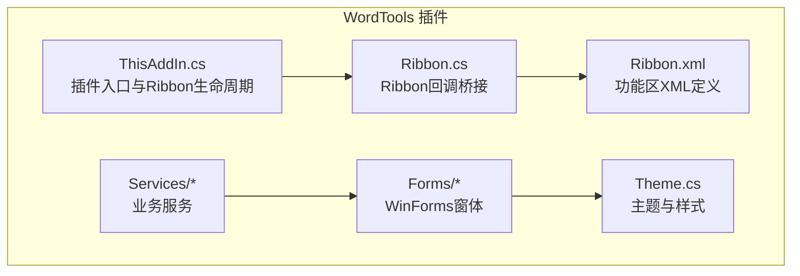
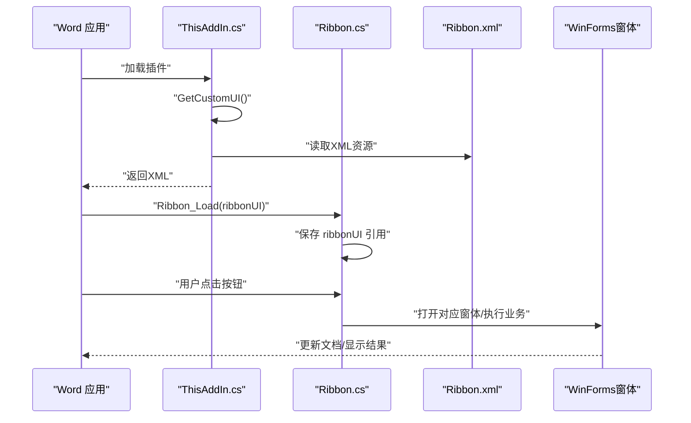
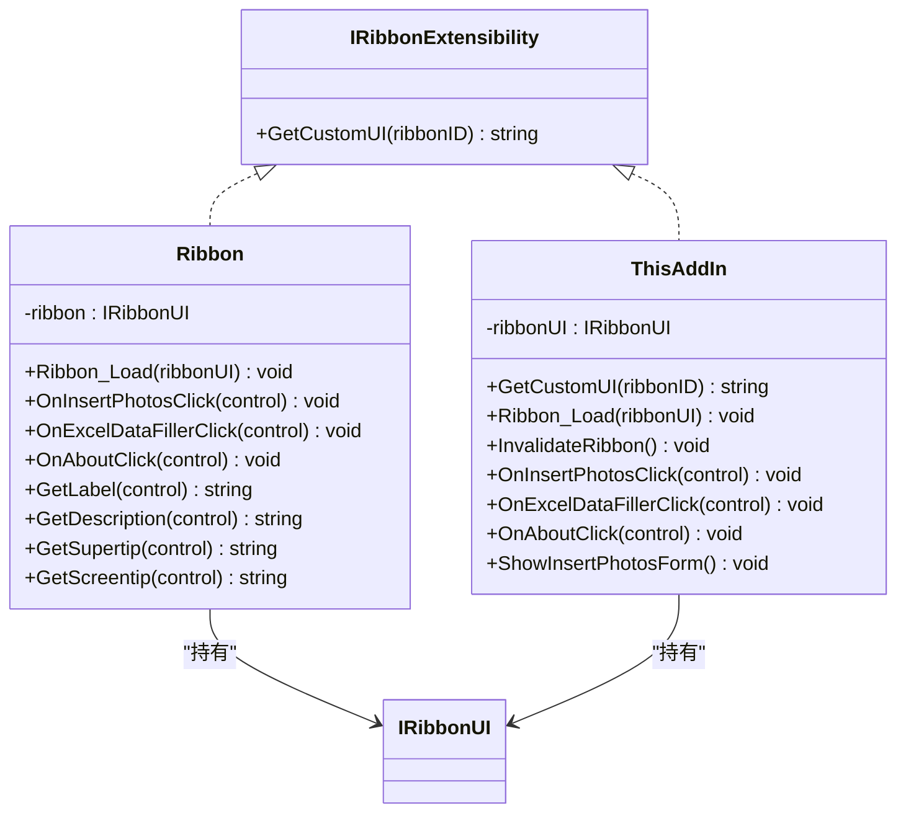
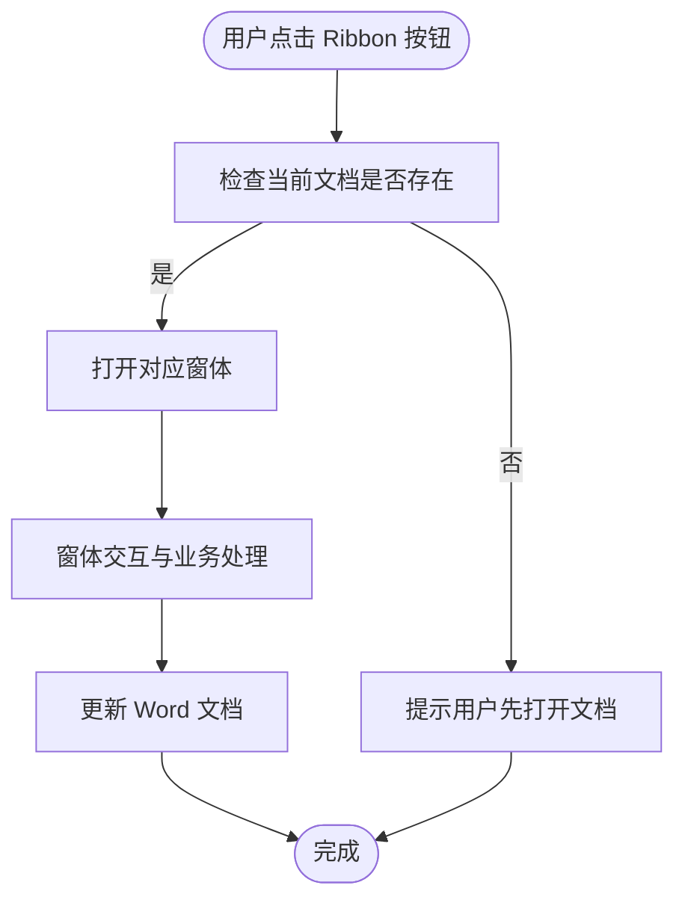
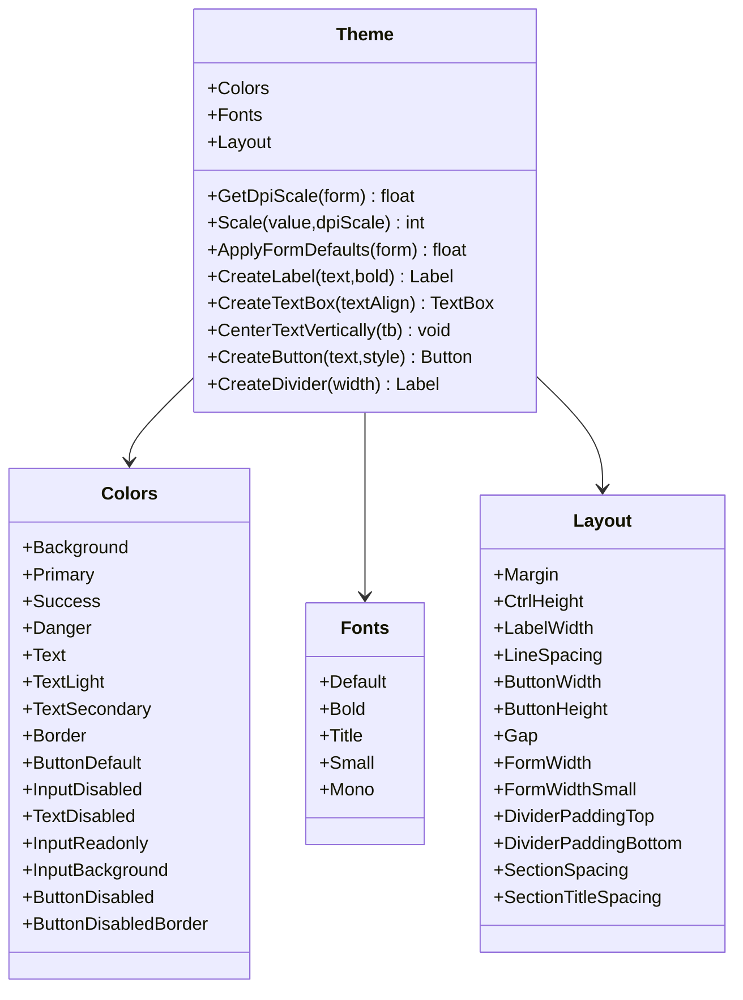
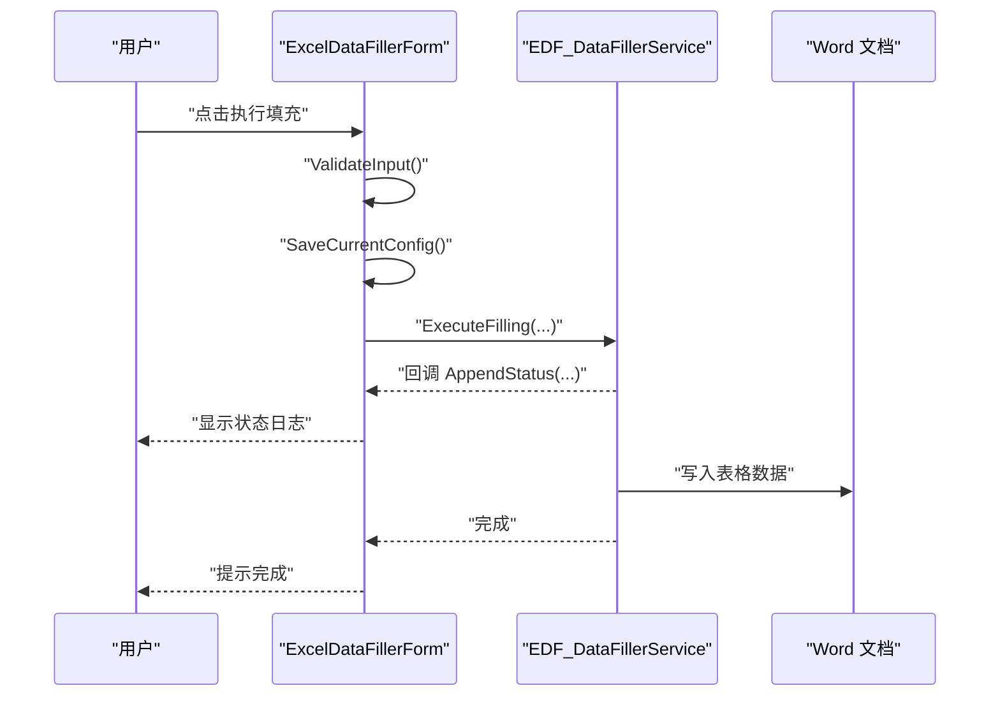
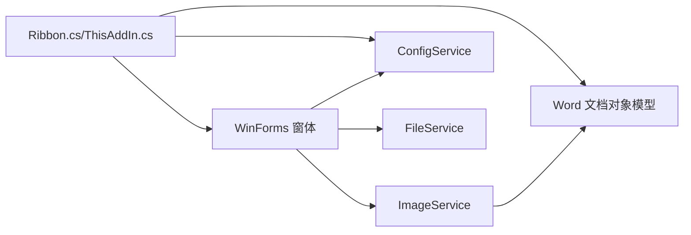
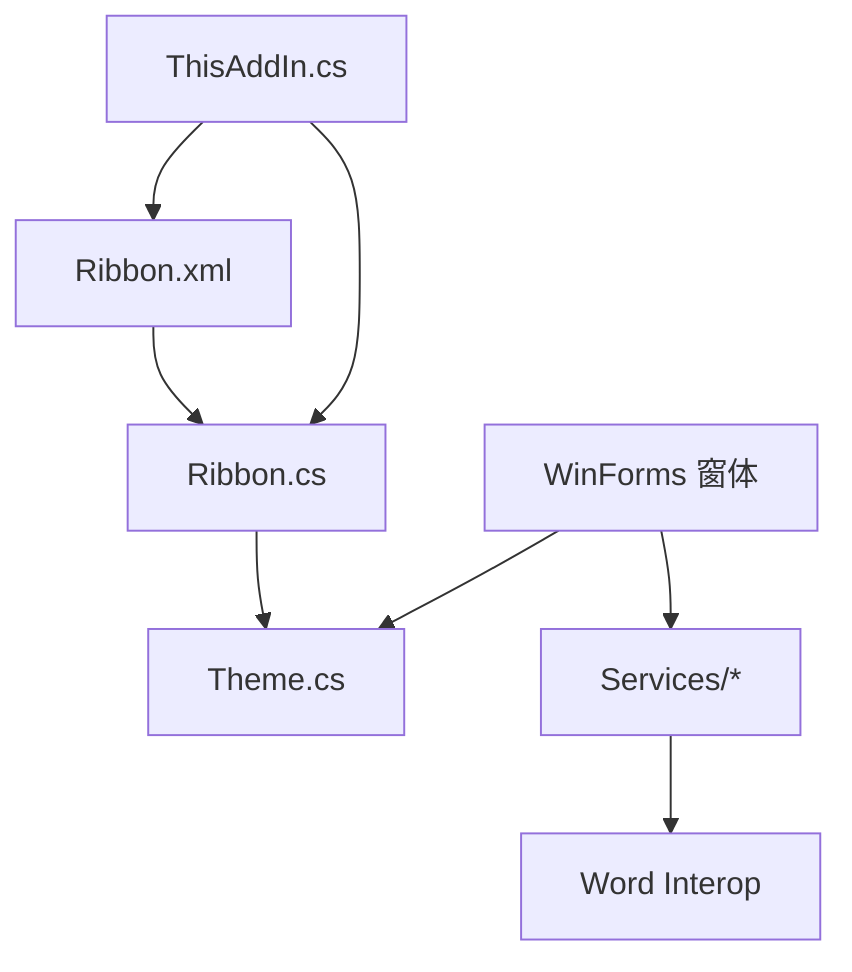

# 界面组件

<cite>
**本文引用的文件**
- [Ribbon.cs](file://WordTools/Ribbon.cs)
- [Ribbon.xml](file://WordTools/Ribbon.xml)
- [Theme.cs](file://WordTools/Theme.cs)
- [ThisAddIn.cs](file://WordTools/ThisAddIn.cs)
- [ExcelDataFillerForm.cs](file://WordTools/Forms/ExcelDataFillerForm.cs)
- [InsertPhotosForm.cs](file://WordTools/Forms/InsertPhotosForm.cs)
- [ConfigService.cs](file://WordTools/Services/ConfigService.cs)
- [FileService.cs](file://WordTools/Services/FileService.cs)
- [ImageService.cs](file://WordTools/Services/ImageService.cs)
- [README.md](file://README.md)
</cite>

## 目录
1. [简介](#简介)
2. [项目结构](#项目结构)
3. [核心组件](#核心组件)
4. [架构总览](#架构总览)
5. [组件详细分析](#组件详细分析)
6. [依赖关系分析](#依赖关系分析)
7. [性能考量](#性能考量)
8. [故障排查指南](#故障排查指南)
9. [结论](#结论)
10. [附录](#附录)

## 简介
本文件面向界面设计师与开发者，系统化梳理 WordTools 插件的界面组件体系，重点覆盖：
- Ribbon 界面系统的设计与实现：XML 定义、界面控制器与事件回调机制
- 自定义 UI 组件的视觉外观、行为与交互模式
- Ribbon 选项卡、组与按钮的组织结构
- 界面主题系统与样式定制
- 界面组件的状态管理、动画与过渡处理
- 响应式设计与无障碍访问合规性建议
- 组件属性、事件与自定义选项
- 与 Word 文档对象模型的集成模式

## 项目结构
WordTools 采用“COM 加载项 + 功能区 XML + WinForms 窗体”的混合架构：
- 功能区通过 Ribbon.xml 定义，Ribbon.cs 提供回调桥接
- 插件入口为 ThisAddIn.cs，负责注册与 Ribbon 生命周期管理
- 窗体层位于 Forms 目录，统一通过 Theme.cs 进行样式与布局管理
- 业务逻辑通过 Services 目录的服务类封装，如配置、文件与图片处理

图表来源
- [ThisAddIn.cs:17-83](file://WordTools/ThisAddIn.cs#L17-L83)
- [Ribbon.cs:14-29](file://WordTools/Ribbon.cs#L14-L29)
- [Ribbon.xml:1-53](file://WordTools/Ribbon.xml#L1-L53)
- [Theme.cs:11-171](file://WordTools/Theme.cs#L11-L171)

章节来源
- [README.md:1-85](file://README.md#L1-L85)
- [ThisAddIn.cs:17-83](file://WordTools/ThisAddIn.cs#L17-L83)
- [Ribbon.cs:14-29](file://WordTools/Ribbon.cs#L14-L29)
- [Ribbon.xml:1-53](file://WordTools/Ribbon.xml#L1-L53)
- [Theme.cs:11-171](file://WordTools/Theme.cs#L11-L171)

## 核心组件
- 功能区控制器：Ribbon.cs 实现 IRibbonExtensibility，提供 Ribbon_Load、按钮回调与动态标签/提示文案
- 功能区 XML：Ribbon.xml 定义选项卡、组与按钮，绑定回调方法
- 插件入口：ThisAddIn.cs 实现 IDTExtensibility2 与 IRibbonExtensibility，负责加载 XML 并暴露 Ribbon 回调
- 主题与样式：Theme.cs 提供颜色、字体、布局常量与控件工厂方法
- 窗体组件：ExcelDataFillerForm.cs、InsertPhotosForm.cs 基于 Theme 统一样式，承载业务交互
- 服务层：ConfigService、FileService、ImageService 封装配置、文件与图片处理逻辑

章节来源
- [Ribbon.cs:14-163](file://WordTools/Ribbon.cs#L14-L163)
- [Ribbon.xml:1-53](file://WordTools/Ribbon.xml#L1-L53)
- [ThisAddIn.cs:17-173](file://WordTools/ThisAddIn.cs#L17-L173)
- [Theme.cs:11-357](file://WordTools/Theme.cs#L11-L357)
- [ExcelDataFillerForm.cs:12-227](file://WordTools/Forms/ExcelDataFillerForm.cs#L12-L227)
- [InsertPhotosForm.cs:19-100](file://WordTools/Forms/InsertPhotosForm.cs#L19-L100)
- [ConfigService.cs:11-462](file://WordTools/Services/ConfigService.cs#L11-L462)
- [FileService.cs:13-309](file://WordTools/Services/FileService.cs#L13-L309)
- [ImageService.cs:10-324](file://WordTools/Services/ImageService.cs#L10-L324)

## 架构总览
Ribbon 界面系统通过 XML 定义与 C# 回调桥接实现，插件入口负责加载 XML 并维护 Ribbon 实例。窗体层通过 Theme 统一风格，并与服务层协作完成业务流程。

图表来源
- [ThisAddIn.cs:64-83](file://WordTools/ThisAddIn.cs#L64-L83)
- [Ribbon.cs:33-48](file://WordTools/Ribbon.cs#L33-L48)
- [Ribbon.xml:2-52](file://WordTools/Ribbon.xml#L2-L52)

## 组件详细分析

### Ribbon 界面系统
- XML 定义：Ribbon.xml 在 onLoad 中绑定 Ribbon_Load，并在各按钮上通过 onAction 指向回调方法
- 控制器桥接：Ribbon.cs 实现 IRibbonExtensibility，GetCustomUI 返回 XML 资源；Ribbon_Load 保存 ribbonUI；提供按钮回调与动态标签/提示
- 回调职责：按钮点击触发窗体展示或简单提示；动态标签/提示根据控件 Id 返回本地化文本

图表来源
- [Ribbon.cs:14-163](file://WordTools/Ribbon.cs#L14-L163)
- [ThisAddIn.cs:17-173](file://WordTools/ThisAddIn.cs#L17-L173)

章节来源
- [Ribbon.xml:2-52](file://WordTools/Ribbon.xml#L2-L52)
- [Ribbon.cs:24-163](file://WordTools/Ribbon.cs#L24-L163)
- [ThisAddIn.cs:64-173](file://WordTools/ThisAddIn.cs#L64-L173)

### 自定义 UI 组件与交互
- 按钮与组：Ribbon.xml 定义了“Word工具箱”选项卡，内含“图片工具”、“工具”、“帮助”三组，分别包含批量插图、Excel数据填充、关于等按钮
- 动态标签与提示：Ribbon.cs 的 GetLabel/GetDescription/GetSupertip/GetScreentip 根据控件 Id 返回本地化文本，提升用户体验
- 事件处理：按钮点击回调负责打开窗体或显示提示；窗体内部再通过服务层完成具体业务

图表来源
- [Ribbon.cs:50-93](file://WordTools/Ribbon.cs#L50-L93)
- [ExcelDataFillerForm.cs:299-355](file://WordTools/Forms/ExcelDataFillerForm.cs#L299-L355)
- [InsertPhotosForm.cs:481-524](file://WordTools/Forms/InsertPhotosForm.cs#L481-L524)

章节来源
- [Ribbon.xml:6-49](file://WordTools/Ribbon.xml#L6-L49)
- [Ribbon.cs:127-161](file://WordTools/Ribbon.cs#L127-L161)
- [ExcelDataFillerForm.cs:299-355](file://WordTools/Forms/ExcelDataFillerForm.cs#L299-L355)
- [InsertPhotosForm.cs:481-524](file://WordTools/Forms/InsertPhotosForm.cs#L481-L524)

### 主题系统与样式定制
- 颜色方案：Theme.Colors 提供背景、主色、成功/危险、文本、边框、按钮与输入框等颜色常量
- 字体方案：Theme.Fonts 提供默认、加粗、标题、小字、等宽字体
- 布局常量：Theme.Layout 定义边距、控件高度、标签宽度、行间距、按钮尺寸、窗体宽度等基准值
- DPI 缩放：Theme.GetDpiScale 与 Scale 方法按当前 DPI 比例缩放像素值，保证不同分辨率下的视觉一致性
- 控件工厂：Theme.CreateLabel、CreateTextBox、CreateButton、CreateDivider 提供统一风格的控件创建与样式应用
- 状态样式：按钮 EnabledChanged 事件中根据启用/禁用状态切换颜色与光标，体现状态反馈

图表来源
- [Theme.cs:11-357](file://WordTools/Theme.cs#L11-L357)

章节来源
- [Theme.cs:16-357](file://WordTools/Theme.cs#L16-L357)

### 窗体组件与状态管理
- Excel 数据填充窗体：ExcelDataFillerForm.cs 通过 Theme 统一样式，包含 Excel 文件路径、锚定字段、目标列、Sample Size 替换等配置项，支持状态日志输出与执行按钮
- 批量插图窗体：InsertPhotosForm.cs 提供文件夹/文件选择、图片高度、范围、描述行与自动编号、对齐方式等配置，支持进度反馈
- 状态管理：窗体内部通过 Enabled/Disabled 控制按钮状态，使用 TextBox 多行只读区域展示状态日志，滚动至末尾以增强可观测性
- 进度与过渡：窗体隐藏后调用 Application.DoEvents() 以让 UI 线程处理消息队列，随后由服务层执行耗时任务，期间通过回调更新状态

图表来源
- [ExcelDataFillerForm.cs:299-355](file://WordTools/Forms/ExcelDataFillerForm.cs#L299-L355)
- [ExcelDataFillerForm.cs:414-429](file://WordTools/Forms/ExcelDataFillerForm.cs#L414-L429)

章节来源
- [ExcelDataFillerForm.cs:12-227](file://WordTools/Forms/ExcelDataFillerForm.cs#L12-L227)
- [ExcelDataFillerForm.cs:299-355](file://WordTools/Forms/ExcelDataFillerForm.cs#L299-L355)
- [InsertPhotosForm.cs:481-524](file://WordTools/Forms/InsertPhotosForm.cs#L481-L524)

### 与 Word 文档对象模型的集成
- 文档上下文：Ribbon.cs 与 ThisAddIn.cs 在按钮回调中通过 Globals.ThisAddIn.Application 访问 Word 应用与活动文档
- 配置持久化：ConfigService 通过文档自定义属性与注册表保存用户偏好，实现跨会话记忆
- 图片插入：ImageService 提供将图片插入单元格、锁定纵横比、按单元格尺寸缩放、最小高度限制等能力
- 文件选择：FileService 提供文件夹与图片文件选择、扩展名校验、自然排序等工具

图表来源
- [Ribbon.cs:50-93](file://WordTools/Ribbon.cs#L50-L93)
- [ThisAddIn.cs:108-142](file://WordTools/ThisAddIn.cs#L108-L142)
- [ConfigService.cs:11-462](file://WordTools/Services/ConfigService.cs#L11-L462)
- [ImageService.cs:10-324](file://WordTools/Services/ImageService.cs#L10-L324)
- [FileService.cs:13-309](file://WordTools/Services/FileService.cs#L13-L309)

章节来源
- [Ribbon.cs:50-93](file://WordTools/Ribbon.cs#L50-L93)
- [ThisAddIn.cs:108-142](file://WordTools/ThisAddIn.cs#L108-L142)
- [ConfigService.cs:11-462](file://WordTools/Services/ConfigService.cs#L11-L462)
- [ImageService.cs:10-324](file://WordTools/Services/ImageService.cs#L10-L324)
- [FileService.cs:13-309](file://WordTools/Services/FileService.cs#L13-L309)

## 依赖关系分析
- Ribbon.cs 与 Ribbon.xml：通过 IRibbonExtensibility 与 onAction 绑定，形成“XML 定义 + C# 回调”的解耦
- ThisAddIn.cs：同时实现 IDTExtensibility2 与 IRibbonExtensibility，承担插件生命周期与 Ribbon 加载职责
- 窗体与 Theme：窗体通过 Theme 统一风格，Theme 依赖 System.Drawing 与 Windows Forms
- 服务层：ConfigService、FileService、ImageService 与 Word Interop、注册表交互，为窗体提供业务支撑

图表来源
- [Ribbon.xml:1-53](file://WordTools/Ribbon.xml#L1-L53)
- [Ribbon.cs:14-163](file://WordTools/Ribbon.cs#L14-L163)
- [ThisAddIn.cs:17-173](file://WordTools/ThisAddIn.cs#L17-L173)
- [Theme.cs:11-357](file://WordTools/Theme.cs#L11-L357)
- [ConfigService.cs:11-462](file://WordTools/Services/ConfigService.cs#L11-L462)
- [FileService.cs:13-309](file://WordTools/Services/FileService.cs#L13-L309)
- [ImageService.cs:10-324](file://WordTools/Services/ImageService.cs#L10-L324)

章节来源
- [Ribbon.xml:1-53](file://WordTools/Ribbon.xml#L1-L53)
- [Ribbon.cs:14-163](file://WordTools/Ribbon.cs#L14-L163)
- [ThisAddIn.cs:17-173](file://WordTools/ThisAddIn.cs#L17-L173)
- [Theme.cs:11-357](file://WordTools/Theme.cs#L11-L357)
- [ConfigService.cs:11-462](file://WordTools/Services/ConfigService.cs#L11-L462)
- [FileService.cs:13-309](file://WordTools/Services/FileService.cs#L13-L309)
- [ImageService.cs:10-324](file://WordTools/Services/ImageService.cs#L10-L324)

## 性能考量
- DPI 缩放：Theme.GetDpiScale 与 Scale 在高 DPI 场景下减少布局抖动，提升渲染效率
- 窗体事件：Application.DoEvents 在状态更新与进度反馈中使用，避免 UI 卡顿
- 批量操作：ImageService 的批量行预分配与批量添加行，减少 Word 对象模型频繁交互带来的开销
- 输入验证：窗体在执行前进行输入校验，降低无效调用导致的异常与回滚成本

章节来源
- [Theme.cs:135-171](file://WordTools/Theme.cs#L135-L171)
- [ExcelDataFillerForm.cs:414-429](file://WordTools/Forms/ExcelDataFillerForm.cs#L414-L429)
- [ImageService.cs:247-277](file://WordTools/Services/ImageService.cs#L247-L277)
- [ExcelDataFillerForm.cs:360-392](file://WordTools/Forms/ExcelDataFillerForm.cs#L360-L392)

## 故障排查指南
- 文档上下文为空：Ribbon.cs 与 ThisAddIn.cs 的按钮回调均包含对活动文档的检查，若为空会提示用户先打开文档
- 错误提示：所有按钮回调与窗体事件均包含 try/catch，捕获异常后通过消息框提示错误信息
- 状态日志：ExcelDataFillerForm 的状态区域支持追加日志并滚动至末尾，便于定位问题
- 配置读写：ConfigService 通过文档自定义属性与注册表双通道读写，若某通道异常可回退到另一通道

章节来源
- [Ribbon.cs:50-93](file://WordTools/Ribbon.cs#L50-L93)
- [ExcelDataFillerForm.cs:324-355](file://WordTools/Forms/ExcelDataFillerForm.cs#L324-L355)
- [ExcelDataFillerForm.cs:414-429](file://WordTools/Forms/ExcelDataFillerForm.cs#L414-L429)
- [ConfigService.cs:28-92](file://WordTools/Services/ConfigService.cs#L28-L92)

## 结论
WordTools 的界面组件以 Ribbon XML 与 C# 回调为核心，结合统一的主题系统与服务层，实现了简洁、一致且可扩展的 UI 体验。通过 DPI 缩放、状态管理与输入验证，提升了在不同环境下的稳定性与可用性。建议在后续迭代中进一步完善无障碍访问与响应式布局策略，持续优化交互反馈与性能表现。

## 附录
- 组件属性与事件
  - Ribbon：Ribbon_Load、OnInsertPhotosClick、OnExcelDataFillerClick、OnAboutClick、GetLabel/GetDescription/GetSupertip/GetScreentip
  - 窗体：按钮 EnabledChanged、状态文本框 AppendStatus、输入校验 ValidateInput
- 自定义选项
  - 主题颜色、字体、布局常量可通过 Theme.cs 修改
  - 窗体尺寸与间距通过 Theme.Layout 常量集中管理
- 与其他 UI 元素的组合
  - 窗体通过 Theme.CreateButton/CreateTextBox 等工厂方法与控件组合，形成统一风格
  - 与 Word 文档对象模型通过 Interop 交互，实现表格、单元格与图片的插入与调整