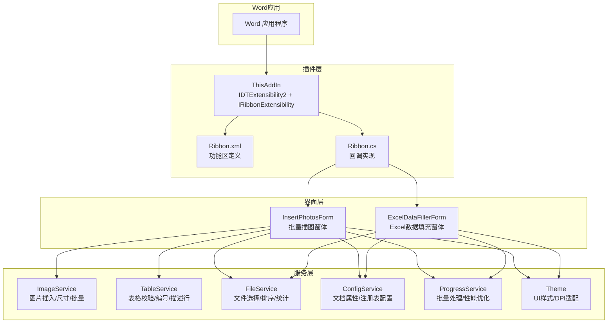
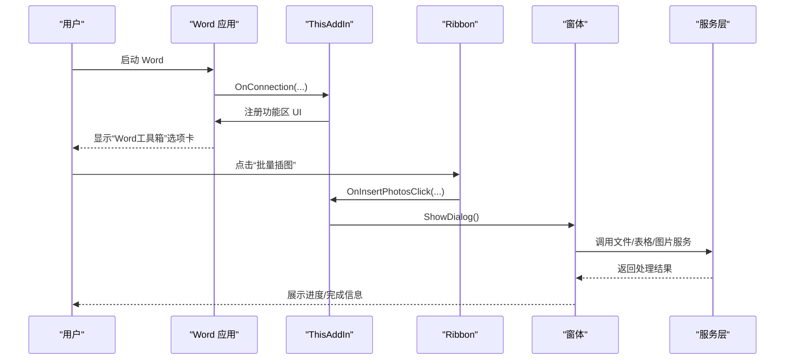
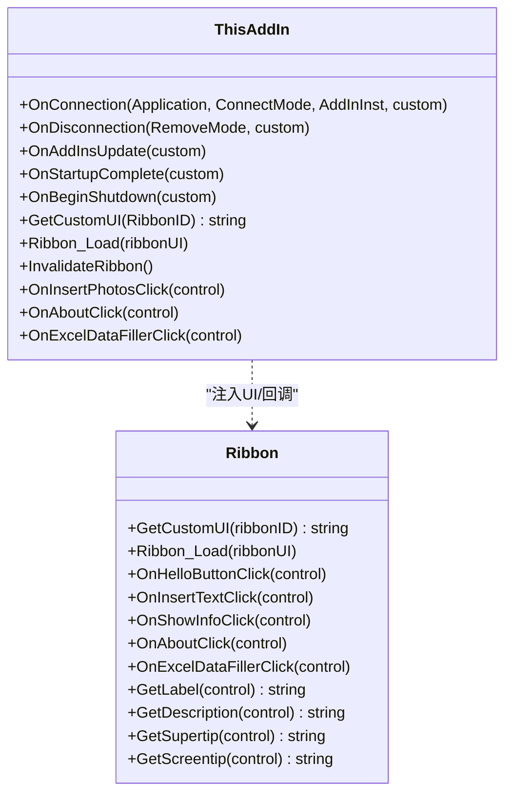
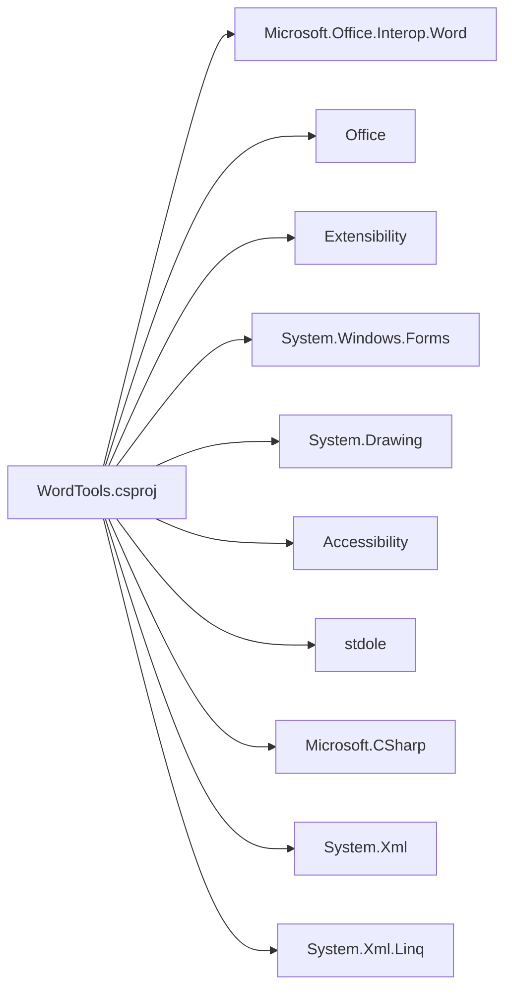

# 项目概述

<cite>
**本文引用的文件**
- [README.md](file://README.md)
- [WordTools.csproj](file://WordTools/WordTools.csproj)
- [ThisAddIn.cs](file://WordTools/ThisAddIn.cs)
- [Ribbon.cs](file://WordTools/Ribbon.cs)
- [Ribbon.xml](file://WordTools/Ribbon.xml)
- [InsertPhotosForm.cs](file://WordTools/Forms/InsertPhotosForm.cs)
- [ExcelDataFillerForm.cs](file://WordTools/Forms/ExcelDataFillerForm.cs)
- [ImageService.cs](file://WordTools/Services/ImageService.cs)
- [TableService.cs](file://WordTools/Services/TableService.cs)
- [ConfigService.cs](file://WordTools/Services/ConfigService.cs)
- [FileService.cs](file://WordTools/Services/FileService.cs)
- [ProgressService.cs](file://WordTools/Services/ProgressService.cs)
- [Theme.cs](file://WordTools/Theme.cs)
- [build.bat](file://build.bat)
</cite>

## 目录
1. [简介](#简介)
2. [项目结构](#项目结构)
3. [核心组件](#核心组件)
4. [架构总览](#架构总览)
5. [详细组件分析](#详细组件分析)
6. [依赖关系分析](#依赖关系分析)
7. [性能考量](#性能考量)
8. [故障排查指南](#故障排查指南)
9. [结论](#结论)
10. [附录](#附录)

## 简介
WordTools 是一个基于 COM 加载项的 Word 插件，安装后会在 Word 功能区新增“Word工具箱”选项卡，提供图片批量插入与 Excel 数据填充两大核心能力，并内置帮助信息。项目采用 C#/.NET Framework 4.8 开发，通过 IDTExtensibility2 接口实现 COM 加载项，配合 Office 功能区 XML 定义与回调，实现与 Word 的深度集成。系统强调易用性与稳定性，支持 Windows 7+、Office 2010+，无需额外安装 VSTO Runtime。

## 项目结构
项目采用“功能区 + 窗体 + 服务层”的分层组织方式：
- 插件入口与功能区：ThisAddIn.cs、Ribbon.cs、Ribbon.xml
- 窗体界面：InsertPhotosForm.cs（批量插图）、ExcelDataFillerForm.cs（Excel数据填充）
- 服务层：ImageService.cs（图片处理）、TableService.cs（表格处理）、FileService.cs（文件操作）、ConfigService.cs（配置持久化）、ProgressService.cs（批量处理与性能优化）
- UI主题：Theme.cs（统一样式与DPI适配）
- 构建与部署：WordTools.csproj、build.bat

图表来源
- [ThisAddIn.cs:17-83](file://WordTools/ThisAddIn.cs#L17-L83)
- [Ribbon.cs:14-36](file://WordTools/Ribbon.cs#L14-L36)
- [Ribbon.xml:1-53](file://WordTools/Ribbon.xml#L1-L53)
- [InsertPhotosForm.cs:19-574](file://WordTools/Forms/InsertPhotosForm.cs#L19-L574)
- [ExcelDataFillerForm.cs:12-432](file://WordTools/Forms/ExcelDataFillerForm.cs#L12-L432)
- [ImageService.cs:10-325](file://WordTools/Services/ImageService.cs#L10-L325)
- [TableService.cs:11-756](file://WordTools/Services/TableService.cs#L11-L756)
- [FileService.cs:13-310](file://WordTools/Services/FileService.cs#L13-L310)
- [ConfigService.cs:11-463](file://WordTools/Services/ConfigService.cs#L11-L463)
- [ProgressService.cs:14-571](file://WordTools/Services/ProgressService.cs#L14-L571)
- [Theme.cs:11-358](file://WordTools/Theme.cs#L11-L358)

章节来源
- [README.md:47-61](file://README.md#L47-L61)
- [WordTools.csproj:1-149](file://WordTools/WordTools.csproj#L1-L149)

## 核心组件
- 插件入口与功能区
  - ThisAddIn.cs 实现 IDTExtensibility2 与 IRibbonExtensibility，负责插件生命周期与功能区 UI 注入。
  - Ribbon.xml 定义“Word工具箱”选项卡及三组按钮（图片工具、工具、帮助）。
  - Ribbon.cs 提供按钮回调与本地化标签/描述/气球提示。
- 界面与交互
  - InsertPhotosForm.cs：批量插图主窗体，支持文件夹/文件选择、图片高度、范围、描述行、自动编号与对齐方式。
  - ExcelDataFillerForm.cs：Excel数据填充主窗体，支持锚定字段、目标列、Sample Size替换等。
- 服务与工具
  - ImageService.cs：图片插入、尺寸转换、批量调整、预分配行数。
  - TableService.cs：表格校验、自动编号、描述行、标题行、空单元格填充。
  - FileService.cs：文件夹/文件选择、扩展名过滤、自然排序、统计。
  - ConfigService.cs：文档自定义属性与注册表配置读写。
  - ProgressService.cs：批量处理进度、取消控制、性能优化（关闭屏幕更新、禁用警告、定期GC）。
  - Theme.cs：统一UI样式、DPI缩放、控件工厂方法。

章节来源
- [ThisAddIn.cs:17-175](file://WordTools/ThisAddIn.cs#L17-L175)
- [Ribbon.cs:14-190](file://WordTools/Ribbon.cs#L14-L190)
- [Ribbon.xml:1-53](file://WordTools/Ribbon.xml#L1-L53)
- [InsertPhotosForm.cs:19-574](file://WordTools/Forms/InsertPhotosForm.cs#L19-L574)
- [ExcelDataFillerForm.cs:12-432](file://WordTools/Forms/ExcelDataFillerForm.cs#L12-L432)
- [ImageService.cs:10-325](file://WordTools/Services/ImageService.cs#L10-L325)
- [TableService.cs:11-756](file://WordTools/Services/TableService.cs#L11-L756)
- [FileService.cs:13-310](file://WordTools/Services/FileService.cs#L13-L310)
- [ConfigService.cs:11-463](file://WordTools/Services/ConfigService.cs#L11-L463)
- [ProgressService.cs:14-571](file://WordTools/Services/ProgressService.cs#L14-L571)
- [Theme.cs:11-358](file://WordTools/Theme.cs#L11-L358)

## 架构总览
WordTools 采用 COM 加载项架构，通过功能区 XML 与回调实现 UI 与业务逻辑解耦。插件在启动时注入功能区 UI，用户点击按钮触发回调，回调再驱动窗体与服务层完成具体任务。服务层内部通过协作实现复杂流程（如批量插入图片的预分配、逐批处理、描述行与编号生成）。

图表来源
- [ThisAddIn.cs:87-170](file://WordTools/ThisAddIn.cs#L87-L170)
- [Ribbon.cs:33-162](file://WordTools/Ribbon.cs#L33-L162)
- [InsertPhotosForm.cs:513-563](file://WordTools/Forms/InsertPhotosForm.cs#L513-L563)
- [ProgressService.cs:148-306](file://WordTools/Services/ProgressService.cs#L148-L306)

## 详细组件分析

### 功能区与插件入口
- ThisAddIn.cs
  - 实现 IDTExtensibility2 生命周期方法，记录全局应用实例。
  - 实现 IRibbonExtensibility，通过资源流读取 Ribbon.xml 并注入功能区 UI。
  - 提供 Ribbon_Load 与 InvalidateRibbon 以刷新 UI 状态。
  - 暴露按钮回调：OnInsertPhotosClick、OnAboutClick、OnExcelDataFillerClick。
- Ribbon.xml
  - 定义“Word工具箱”选项卡，紧随“开始”选项卡之后。
  - 定义三组：图片工具（批量插图）、工具（Excel数据填充）、帮助（关于）。
- Ribbon.cs
  - 实现 IRibbonExtensibility，加载 Ribbon.xml。
  - 提供按钮回调（文本插入、文档信息、关于、Excel数据填充）与本地化标签/描述/气球提示。

图表来源
- [ThisAddIn.cs:17-175](file://WordTools/ThisAddIn.cs#L17-L175)
- [Ribbon.cs:14-190](file://WordTools/Ribbon.cs#L14-L190)

章节来源
- [ThisAddIn.cs:17-175](file://WordTools/ThisAddIn.cs#L17-L175)
- [Ribbon.cs:14-190](file://WordTools/Ribbon.cs#L14-L190)
- [Ribbon.xml:1-53](file://WordTools/Ribbon.xml#L1-L53)

### 图片批量插入工具
- InsertPhotosForm.cs
  - 窗体布局与DPI适配：通过 Theme.cs 统一控件样式与缩放。
  - 功能选项：文件夹/文件选择、图片高度（厘米转磅）、范围（根目录/子目录）、描述行（手动/无/文件名）、自动编号与对齐方式。
  - 配置持久化：通过 ConfigService 读写文档属性与注册表。
  - 事件处理：浏览文件夹、插入文件夹、选择文件；调用 ProgressService 执行批量插入。
- ProgressService.cs
  - 性能优化：进入/退出高性能模式（关闭 ScreenUpdating、DisplayAlerts、Spell/Grammar 校验）。
  - 批量处理：按批次处理文件，动态更新状态栏，支持 ESC 取消。
  - 预分配与布局：根据图片数量预分配表格行，按两列布局，自动插入描述行或文件名描述行。
  - 编号与对齐：根据配置生成自定义编号列表，支持居左/居中/靠右。
- ImageService.cs
  - 图片插入与尺寸：锁定纵横比，按单元格宽度与高度限制缩放，支持最小高度约束。
  - 批量调整：遍历表格内图片，按单元格边界重设尺寸。
  - 预分配：批量添加行，分批更新状态栏。
- TableService.cs
  - 校验与定位：判断选择是否在表格、是否在首列；寻找合适单元格插入。
  - 标题行与描述行：创建标题行、插入文件名描述行、填充空单元格为 N/A。
  - 自动编号：检测原有编号对齐方式，创建自定义列表模板，应用到描述行。
- FileService.cs
  - 文件选择与过滤：支持 JPG/JPEG/PNG；多选文件对话框。
  - 文件扫描：自然排序、根目录/子目录扫描、统计总数。
- ConfigService.cs
  - 文档属性与注册表：统一存储图片高度、文件夹路径、描述行策略、范围、自动编号与对齐方式；Excel数据填充相关配置。
- Theme.cs
  - 统一颜色、字体、布局常量；控件工厂方法；DPI缩放与垂直居中。

图表来源
- [InsertPhotosForm.cs:513-563](file://WordTools/Forms/InsertPhotosForm.cs#L513-L563)
- [ProgressService.cs:148-306](file://WordTools/Services/ProgressService.cs#L148-L306)
- [ImageService.cs:73-180](file://WordTools/Services/ImageService.cs#L73-L180)
- [TableService.cs:304-434](file://WordTools/Services/TableService.cs#L304-L434)
- [FileService.cs:117-188](file://WordTools/Services/FileService.cs#L117-L188)
- [ConfigService.cs:149-357](file://WordTools/Services/ConfigService.cs#L149-L357)

章节来源
- [InsertPhotosForm.cs:19-574](file://WordTools/Forms/InsertPhotosForm.cs#L19-L574)
- [ProgressService.cs:14-571](file://WordTools/Services/ProgressService.cs#L14-L571)
- [ImageService.cs:10-325](file://WordTools/Services/ImageService.cs#L10-L325)
- [TableService.cs:11-756](file://WordTools/Services/TableService.cs#L11-L756)
- [FileService.cs:13-310](file://WordTools/Services/FileService.cs#L13-L310)
- [ConfigService.cs:11-463](file://WordTools/Services/ConfigService.cs#L11-L463)
- [Theme.cs:11-358](file://WordTools/Theme.cs#L11-L358)

### Excel数据填充工具
- ExcelDataFillerForm.cs
  - 界面：Excel文件路径、锚定字段、目标列、Sample Size替换开关与所在列。
  - 输入验证：Excel文件存在性、锚定字段非空、目标列数字有效性、Sample Size列必填。
  - 执行流程：收集参数、保存配置、同步执行填充、状态输出。
- EDF_DataFillerService（未在当前仓库中出现，但由 ExcelDataFillerForm.cs 引用）
  - 作用：根据锚定字段与目标列，从Excel读取数据并填充到Word表格中，支持Sample Size替换。
- ConfigService.cs
  - 提供 Excel 路径、锚定字段、目标列、Sample Size列与替换开关的读写。

章节来源
- [ExcelDataFillerForm.cs:12-432](file://WordTools/Forms/ExcelDataFillerForm.cs#L12-L432)
- [ConfigService.cs:369-458](file://WordTools/Services/ConfigService.cs#L369-L458)

### 帮助功能组
- 关于按钮：显示版本信息与使用说明。
- 其他演示按钮：文本插入、文档信息展示（用于演示功能区回调与Word对象模型交互）。

章节来源
- [Ribbon.cs:95-125](file://WordTools/Ribbon.cs#L95-L125)
- [ThisAddIn.cs:116-125](file://WordTools/ThisAddIn.cs#L116-L125)

## 依赖关系分析
- COM 加载项依赖
  - IDTExtensibility2：插件生命周期接口。
  - IRibbonExtensibility：功能区 UI 注入接口。
  - Office Interop：Microsoft.Office.Interop.Word、Office、Extensibility。
- 项目依赖
  - System.Windows.Forms、System.Drawing、System.Xml、System.Xml.Linq、Accessibility、stdole。
- 构建与部署
  - .NET Framework 4.8；MSBuild；regasm 手动注册；build.bat 自动构建与部署。

图表来源
- [WordTools.csproj:60-98](file://WordTools/WordTools.csproj#L60-L98)

章节来源
- [WordTools.csproj:1-149](file://WordTools/WordTools.csproj#L1-L149)

## 性能考量
- 性能优化
  - 高性能模式：关闭 ScreenUpdating、DisplayAlerts、Spell/Grammar 校验，减少 UI 刷新与警告弹窗。
  - 批处理间隔：根据文件数量动态调整刷新/内存清理/保存间隔，平衡流畅度与性能。
  - 内存管理：定期触发 GC，避免长时间批量处理导致内存占用过高。
- 用户体验
  - 状态栏实时反馈：显示进度百分比、已用时间、剩余时间与当前文件名。
  - 取消机制：支持 ESC 键随时取消，及时释放资源并提示结果。
- 表格与图片
  - 预分配行数：避免频繁插入导致的性能抖动。
  - 锁定纵横比与按单元格边界缩放：保证图片显示质量与表格整洁。

章节来源
- [ProgressService.cs:73-143](file://WordTools/Services/ProgressService.cs#L73-L143)
- [ProgressService.cs:117-125](file://WordTools/Services/ProgressService.cs#L117-L125)
- [ProgressService.cs:539-566](file://WordTools/Services/ProgressService.cs#L539-L566)

## 故障排查指南
- 安装与注册
  - 手动注册：使用 regasm /codebase 注册插件 DLL。
  - 卸载：使用 regasm /u 卸载，或在 Word 加载项管理中禁用。
- COM 加载项不可见
  - 确认已以管理员权限运行命令提示符。
  - 确认 .NET Framework 4.8 已安装。
- 功能区按钮无响应
  - 检查功能区 XML 是否正确嵌入资源，确认回调方法签名与 ID 匹配。
  - 确认 ThisAddIn 已正确注入功能区 UI。
- 批量插入异常
  - 检查表格是否处于首列，确保选择的是表格。
  - 检查图片文件是否为受支持格式，路径是否有效。
  - 若出现内存问题，尝试减少一次性处理的文件数量或重启 Word。
- 配置丢失
  - 配置同时保存在文档自定义属性与注册表，若文档损坏可回退到注册表读取。

章节来源
- [README.md:30-75](file://README.md#L30-L75)
- [build.bat:1-125](file://build.bat#L1-L125)
- [ThisAddIn.cs:66-81](file://WordTools/ThisAddIn.cs#L66-L81)

## 结论
WordTools 通过 COM 加载项架构实现了与 Word 的深度集成，功能区 UI 与业务逻辑清晰分离，服务层提供了稳健的图片批量插入与 Excel 数据填充能力。项目在易用性、性能与可维护性之间取得良好平衡，适合在企业文档自动化场景中部署与使用。选择 COM 加载项而非 VSTO 的设计，降低了运行时依赖，便于分发与维护。

## 附录
- 系统要求
  - Windows 7+、Office 2010+、.NET Framework 4.8。
- 技术背景与设计理念
  - 采用 COM 加载项（IDTExtensibility2 + IRibbonExtensibility）实现，无需 VSTO Runtime，减少外部依赖。
  - 功能区 XML 与回调分离，便于 UI 与逻辑解耦。
  - 服务层封装复杂流程，窗体仅负责交互与配置，提升可测试性与可维护性。
- 构建与部署
  - 使用 build.bat 自动查找 MSBuild、还原包、编译 Release 并复制部署文件。
  - 通过 WordTools.sln 在 Visual Studio 中调试与发布。

章节来源
- [README.md:15-20](file://README.md#L15-L20)
- [README.md:76-81](file://README.md#L76-L81)
- [build.bat:1-125](file://build.bat#L1-L125)
- [WordTools.csproj:1-149](file://WordTools/WordTools.csproj#L1-L149)