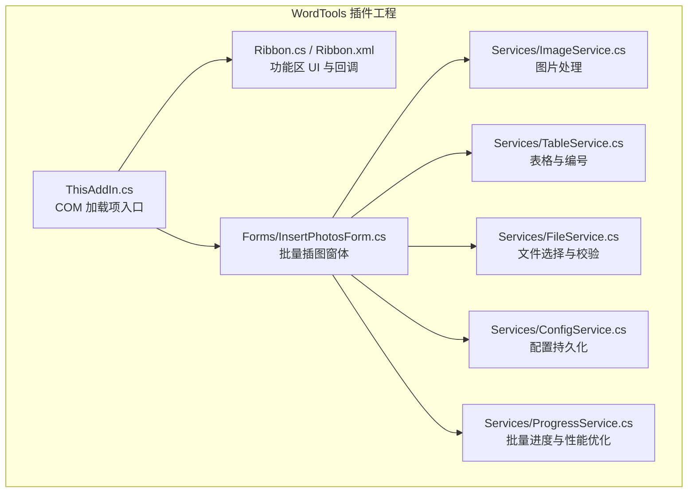
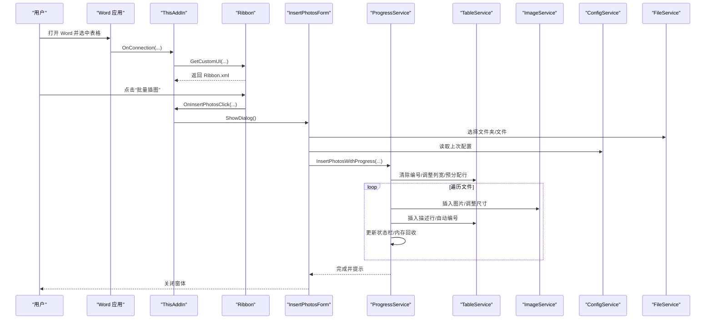
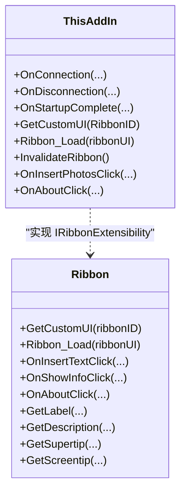
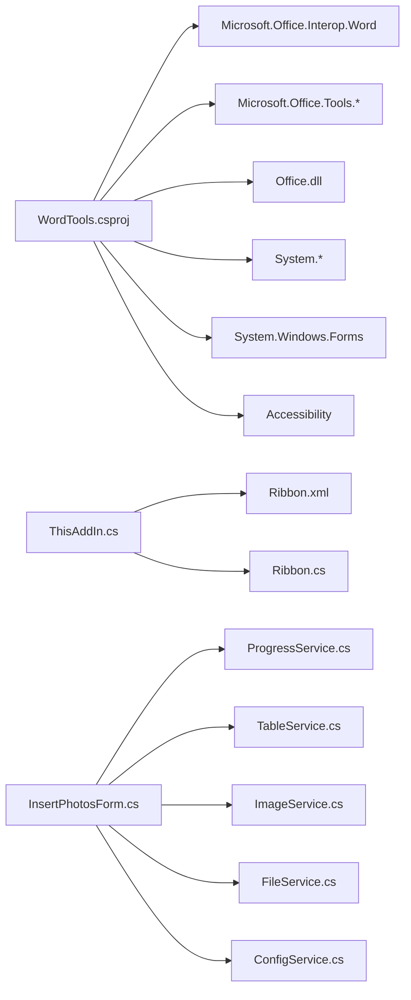

# 项目概述

<cite>
**本文引用的文件**
- [README.md](file://README.md)
- [WordTools.csproj](file://WordTools/WordTools.csproj)
- [Ribbon.cs](file://WordTools/Ribbon.cs)
- [Ribbon.xml](file://WordTools/Ribbon.xml)
- [ThisAddIn.cs](file://WordTools/ThisAddIn.cs)
- [InsertPhotosForm.cs](file://WordTools/Forms/InsertPhotosForm.cs)
- [ImageService.cs](file://WordTools/Services/ImageService.cs)
- [TableService.cs](file://WordTools/Services/TableService.cs)
- [ConfigService.cs](file://WordTools/Services/ConfigService.cs)
- [FileService.cs](file://WordTools/Services/FileService.cs)
- [ProgressService.cs](file://WordTools/Services/ProgressService.cs)
- [build.bat](file://build.bat)
- [RegisterPlugin.bat](file://RegisterPlugin.bat)
</cite>

## 目录
1. [简介](#简介)
2. [项目结构](#项目结构)
3. [核心组件](#核心组件)
4. [架构总览](#架构总览)
5. [详细组件分析](#详细组件分析)
6. [依赖关系分析](#依赖关系分析)
7. [性能考量](#性能考量)
8. [故障排查指南](#故障排查指南)
9. [结论](#结论)
10. [附录](#附录)

## 简介
WordTools 是一个基于 COM 加载项（IDTExtensibility2）的 Microsoft Word 插件，安装后在 Word 功能区新增“Word工具箱”选项卡，提供批量图片插入、自动编号与描述行管理等实用功能。项目采用 C#/.NET Framework 4.8 开发，通过功能区 XML 定义界面，并以 WinForms 窗体承载交互逻辑。

- 价值主张
  - 降低重复劳动：一键批量插入图片到表格，支持文件夹扫描与子目录遍历。
  - 规范化排版：自动编号与描述行管理，提升文档一致性。
  - 用户友好：直观的图形界面与进度反馈，支持 ESC 取消。
  - 兼容性强：无需 VSTO Runtime，面向 Office 2010+ 与 Windows 7+。

- 独特优势
  - 功能区集成：通过功能区 XML 与回调方法，直接在 Word 顶部添加自定义选项卡与按钮。
  - 低耦合设计：服务层（图像、表格、文件、配置、进度）职责清晰，便于维护与扩展。
  - 性能优化：批量处理时关闭屏幕更新、禁用警告、定期内存回收，显著提升吞吐。

**章节来源**
- [README.md:1-85](file://README.md#L1-L85)

## 项目结构
项目采用“插件工程 + 服务层 + 界面窗体”的分层组织：
- WordTools/ 插件工程
  - ThisAddIn.cs：COM 加载项入口，实现 IDTExtensibility2 与 IRibbonExtensibility。
  - Ribbon.cs / Ribbon.xml：功能区 UI 定义与回调。
  - Forms/InsertPhotosForm.cs：批量插图主窗体。
  - Services/*：图像、表格、文件、配置、进度等服务模块。
- 构建与部署
  - build.bat：自动化构建与输出。
  - RegisterPlugin.bat：注册 COM 组件与 Word 加载项。
  - Setup.iss：安装包脚本（Inno Setup）。

**图表来源**
- [ThisAddIn.cs:13-17](file://WordTools/ThisAddIn.cs#L13-L17)
- [Ribbon.cs:13-172](file://WordTools/Ribbon.cs#L13-L172)
- [Ribbon.xml:1-39](file://WordTools/Ribbon.xml#L1-L39)
- [InsertPhotosForm.cs:18-618](file://WordTools/Forms/InsertPhotosForm.cs#L18-L618)
- [ImageService.cs:10-325](file://WordTools/Services/ImageService.cs#L10-L325)
- [TableService.cs:11-756](file://WordTools/Services/TableService.cs#L11-L756)
- [FileService.cs:13-310](file://WordTools/Services/FileService.cs#L13-L310)
- [ConfigService.cs:11-362](file://WordTools/Services/ConfigService.cs#L11-L362)
- [ProgressService.cs:14-571](file://WordTools/Services/ProgressService.cs#L14-L571)

**章节来源**
- [README.md:47-61](file://README.md#L47-L61)
- [WordTools.csproj:99-127](file://WordTools/WordTools.csproj#L99-L127)

## 核心组件
- 插件入口（ThisAddIn）
  - 实现 IDTExtensibility2 与 IRibbonExtensibility，负责 Word 应用连接、Ribbon UI 加载与按钮回调转发。
  - 提供 Ribbon_Load 与 InvalidateRibbon 等能力，确保功能区状态同步。
- 功能区（Ribbon + Ribbon.xml）
  - XML 定义“Word工具箱”选项卡，包含“图片工具”和“帮助”两组按钮。
  - 回调方法映射至 ThisAddIn.cs 的 OnInsertPhotosClick、OnAboutClick。
- 批量插图窗体（InsertPhotosForm）
  - 提供文件夹浏览、图片高度限制、范围选择（根目录/子目录）、描述行策略（手动/无/文件名）、自动编号与对齐方式等配置。
  - 通过 ProgressService 执行批量插入，实时更新状态栏与进度。
- 服务层
  - ImageService：图片插入、尺寸转换与批量调整、预分配行数。
  - TableService：表格验证、标题行/描述行、自动编号、清空编号、单元格适配。
  - FileService：文件夹/文件选择、扩展名校验、自然排序、统计。
  - ConfigService：文档自定义属性与注册表配置持久化。
  - ProgressService：批量处理性能优化、进度更新、取消控制（ESC）。

**章节来源**
- [ThisAddIn.cs:17-156](file://WordTools/ThisAddIn.cs#L17-L156)
- [Ribbon.cs:24-172](file://WordTools/Ribbon.cs#L24-L172)
- [Ribbon.xml:4-36](file://WordTools/Ribbon.xml#L4-L36)
- [InsertPhotosForm.cs:52-618](file://WordTools/Forms/InsertPhotosForm.cs#L52-L618)
- [ImageService.cs:10-325](file://WordTools/Services/ImageService.cs#L10-L325)
- [TableService.cs:11-756](file://WordTools/Services/TableService.cs#L11-L756)
- [FileService.cs:13-310](file://WordTools/Services/FileService.cs#L13-L310)
- [ConfigService.cs:11-362](file://WordTools/Services/ConfigService.cs#L11-L362)
- [ProgressService.cs:14-571](file://WordTools/Services/ProgressService.cs#L14-L571)

## 架构总览
整体采用“插件入口 + 功能区 + 窗体 + 服务层”的分层架构，数据流从 Word 选择区进入，经由窗体配置与服务层处理，最终落盘到表格中并应用编号与描述行。

**图表来源**
- [ThisAddIn.cs:65-150](file://WordTools/ThisAddIn.cs#L65-L150)
- [Ribbon.cs:24-111](file://WordTools/Ribbon.cs#L24-L111)
- [InsertPhotosForm.cs:525-613](file://WordTools/Forms/InsertPhotosForm.cs#L525-L613)
- [ProgressService.cs:151-306](file://WordTools/Services/ProgressService.cs#L151-L306)
- [TableService.cs:18-756](file://WordTools/Services/TableService.cs#L18-L756)
- [ImageService.cs:73-180](file://WordTools/Services/ImageService.cs#L73-L180)
- [ConfigService.cs:149-362](file://WordTools/Services/ConfigService.cs#L149-L362)
- [FileService.cs:57-188](file://WordTools/Services/FileService.cs#L57-L188)

## 详细组件分析

### 功能区与插件入口
- 功能区 XML 定义“Word工具箱”选项卡，紧随“开始”选项卡之后；包含“图片工具”与“帮助”两组按钮，分别映射到批量插图与关于信息。
- ThisAddIn 实现 IDTExtensibility2 生命周期回调（OnConnection/OnDisconnection/OnStartupComplete 等），并在 GetCustomUI 中加载 Ribbon.xml。
- Ribbon.cs 提供标签与提示文本本地化，以及按钮点击回调（演示用途）。

**图表来源**
- [ThisAddIn.cs:37-150](file://WordTools/ThisAddIn.cs#L37-L150)
- [Ribbon.cs:24-172](file://WordTools/Ribbon.cs#L24-L172)

**章节来源**
- [Ribbon.xml:4-36](file://WordTools/Ribbon.xml#L4-L36)
- [Ribbon.cs:33-146](file://WordTools/Ribbon.cs#L33-L146)
- [ThisAddIn.cs:65-150](file://WordTools/ThisAddIn.cs#L65-L150)

### 批量插图窗体与流程
- 窗体布局与交互：文件夹路径、图片高度、范围选择、描述行策略、自动编号与对齐方式、操作按钮。
- 配置持久化：通过 ConfigService 读取/保存上次设置。
- 批量处理：ProgressService 负责性能优化（关闭屏幕更新、禁用警告、定期内存回收）、进度更新与取消控制（ESC）。
- 数据流：FileService 获取文件列表，ImageService 插入图片并按单元格尺寸约束，TableService 管理标题行、描述行与自动编号。

**图表来源**
- [InsertPhotosForm.cs:525-613](file://WordTools/Forms/InsertPhotosForm.cs#L525-L613)
- [ProgressService.cs:151-306](file://WordTools/Services/ProgressService.cs#L151-L306)
- [ImageService.cs:73-180](file://WordTools/Services/ImageService.cs#L73-L180)
- [TableService.cs:304-434](file://WordTools/Services/TableService.cs#L304-L434)
- [ConfigService.cs:149-362](file://WordTools/Services/ConfigService.cs#L149-L362)
- [FileService.cs:117-188](file://WordTools/Services/FileService.cs#L117-L188)

**章节来源**
- [InsertPhotosForm.cs:525-613](file://WordTools/Forms/InsertPhotosForm.cs#L525-L613)
- [ProgressService.cs:151-306](file://WordTools/Services/ProgressService.cs#L151-L306)

### 图像服务（ImageService）
- 尺寸转换：厘米与磅之间的双向转换，支持最小高度限制。
- 图片插入：按单元格尺寸约束插入图片，保持宽高比，必要时缩放。
- 批量操作：批量调整图片尺寸、批量添加行、预分配行数，减少频繁 COM 调用带来的性能损耗。

**章节来源**
- [ImageService.cs:22-180](file://WordTools/Services/ImageService.cs#L22-L180)
- [ImageService.cs:186-320](file://WordTools/Services/ImageService.cs#L186-L320)

### 表格服务（TableService）
- 表格验证：判断当前选择是否在表格、是否在第一列、获取当前表格对象。
- 单元格适配：检测单元格是否适合插入图片，必要时清除编号或文本。
- 标题行与描述行：创建标题行、插入描述行或文件名描述行，支持居中/靠左/靠右对齐。
- 自动编号：清除原有编号、识别编号对齐方式、在描述行添加编号并保持连续性。

**章节来源**
- [TableService.cs:18-196](file://WordTools/Services/TableService.cs#L18-L196)
- [TableService.cs:304-434](file://WordTools/Services/TableService.cs#L304-L434)
- [TableService.cs:446-737](file://WordTools/Services/TableService.cs#L446-L737)

### 文件服务（FileService）
- 文件夹/文件选择：支持多选图片文件，过滤 .jpg/.jpeg/.png。
- 文件校验：扩展名校验、文件存在性检查。
- 文件枚举：支持根目录与子目录扫描，自然排序（类似资源管理器）。
- 统计：统计总图片数量，支持根目录与子目录组合。

**章节来源**
- [FileService.cs:57-188](file://WordTools/Services/FileService.cs#L57-L188)

### 配置服务（ConfigService）
- 文档自定义属性：优先存储于当前文档自定义属性，便于按文档隔离配置。
- 注册表回退：若文档属性不可用，则回退到当前用户的注册表项。
- 键值管理：图片高度、文件夹路径、描述行策略、范围选择、自动编号与对齐方式等。

**章节来源**
- [ConfigService.cs:149-362](file://WordTools/Services/ConfigService.cs#L149-L362)

### 进度服务（ProgressService）
- 取消控制：检测 ESC 键，支持中途取消。
- 性能优化：关闭 ScreenUpdating 与 DisplayAlerts，减少 UI 刷新与警告弹窗。
- 进度反馈：根据文件总数动态调整刷新间隔、内存回收与保存间隔，实时更新状态栏。
- 批量处理：封装“文件夹批量”与“选中文件批量”，统一处理流程。

**章节来源**
- [ProgressService.cs:43-143](file://WordTools/Services/ProgressService.cs#L43-L143)
- [ProgressService.cs:151-403](file://WordTools/Services/ProgressService.cs#L151-L403)

## 依赖关系分析
- 插件工程依赖 Office Interop 与 VS Tools（PIA），通过项目文件引用 Office、Word、Office Tools 等程序集。
- 插件入口与功能区通过 COM 可见性暴露，支持 Word 动态加载。
- 窗体依赖服务层，服务层之间相互协作，形成清晰的职责边界。

**图表来源**
- [WordTools.csproj:62-88](file://WordTools/WordTools.csproj#L62-L88)
- [ThisAddIn.cs:17-150](file://WordTools/ThisAddIn.cs#L17-L150)
- [Ribbon.xml:1-39](file://WordTools/Ribbon.xml#L1-L39)
- [Ribbon.cs:14-172](file://WordTools/Ribbon.cs#L14-L172)
- [InsertPhotosForm.cs:52-618](file://WordTools/Forms/InsertPhotosForm.cs#L52-L618)

**章节来源**
- [WordTools.csproj:62-88](file://WordTools/WordTools.csproj#L62-L88)

## 性能考量
- 屏幕更新与警告：在批量处理期间关闭 ScreenUpdating 与 DisplayAlerts，显著减少 UI 刷新与弹窗开销。
- 内存回收：按批次定期触发 GC，避免长时间运行导致内存占用过高。
- 批量预分配：提前为表格添加行，减少频繁的 Rows.Add 调用。
- 刷新频率自适应：根据文件总数动态调整状态栏刷新、内存回收与保存间隔，平衡流畅度与性能。
- 取消机制：支持 ESC 键取消，及时释放资源并恢复环境。

**章节来源**
- [ProgressService.cs:73-143](file://WordTools/Services/ProgressService.cs#L73-L143)
- [ImageService.cs:287-320](file://WordTools/Services/ImageService.cs#L287-L320)

## 故障排查指南
- 安装与注册
  - 若 Word 中找不到插件，确认已以管理员身份运行注册脚本，并在 Word“加载项”中启用。
  - 如需卸载，可通过注册脚本反向执行，或在 Word 中禁用。
- COM 组件问题
  - 确认 .NET Framework 4.8 已安装，且 regasm 路径正确。
  - 若注册失败，检查 DLL 是否已生成且具有正确的程序集信息。
- 功能区不可见
  - 确认 Ribbon.xml 已嵌入资源，且 ThisAddIn.GetCustomUI 返回正确内容。
  - 检查功能区回调方法是否正确映射到按钮事件。
- 批量插入异常
  - 确认已选中表格且光标位于第一列。
  - 检查图片文件是否为受支持的扩展名，路径是否存在。
  - 若出现内存不足，尝试减少一次性处理的文件数量或关闭其他 Office 窗口。
- 自动编号与描述行
  - 若编号错乱，检查表格是否已有编号，或单元格内容是否包含纯数字序列。
  - 对齐方式可在配置中调整，确保与文档风格一致。

**章节来源**
- [README.md:62-75](file://README.md#L62-L75)
- [RegisterPlugin.bat:8-80](file://RegisterPlugin.bat#L8-L80)
- [Ribbon.xml:1-39](file://WordTools/Ribbon.xml#L1-L39)
- [InsertPhotosForm.cs:525-613](file://WordTools/Forms/InsertPhotosForm.cs#L525-L613)

## 结论
WordTools 通过简洁而强大的功能区集成与服务化架构，为 Word 用户提供了高效、稳定的批量图片插入体验。其低耦合的服务层设计、完善的性能优化与灵活的配置持久化，使得该插件既易于使用又便于扩展。对于需要频繁处理图片与表格的用户而言，WordTools 是一个值得信赖的工具。

## 附录

### 快速开始指南
- 系统要求
  - Windows 7 或更高版本
  - Microsoft Office 2010 或更高版本（Word）
  - .NET Framework 4.8
- 安装步骤
  - 使用 Visual Studio 打开解决方案，选择 Debug/Release 配置并构建。
  - 运行注册脚本以注册 COM 组件并添加 Word 加载项。
  - 在 Word 中打开“文件 → 选项 → 加载项”，启用“Word工具箱”。
- 基本使用
  - 在 Word 中选中表格并将光标置于第一列，点击“Word工具箱 → 图片工具 → 批量插图”。
  - 在弹窗中选择文件夹或文件，设置图片高度、范围、描述行策略与自动编号，点击“插入文件夹”或“选择文件”开始批量插入。
  - 插入过程中可按 ESC 键取消。

**章节来源**
- [README.md:15-46](file://README.md#L15-L46)
- [build.bat:93-125](file://build.bat#L93-L125)
- [RegisterPlugin.bat:69-79](file://RegisterPlugin.bat#L69-L79)